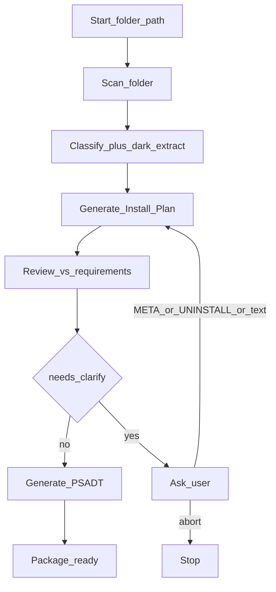

# Packaging AI — Project Requirements & Architecture

## 1. Overview

Packaging AI is an AI-assisted Windows software packaging system that produces **PSADT 3.10.2** deployment packages from installer media.

This repository is a **Python / LangGraph backend**, delivered as a **CLI** (`packaging-ai`). A web UI / HTTP API and VM-based package testing are later consumers of this backend and are out of scope for v1.0.

**Primary outcome:** given an absolute folder path of installer media, the system:

1. Scans and classifies installers (MSI / MST / EXE families)
2. For EXEs, attempts **WiX dark.exe** extraction; if an MSI is found, packages as MSI
3. Reads MSI metadata (ProductName, Version, Manufacturer, ProductCode, UpgradeCode, **Platform → `$appArch`**)
4. Builds a structured **`Install_Plan`** with **rule-based** planning (no LLM)
5. Reviews the plan against `Templates/PSADT_Requirements.md` (Cursor SDK if `CURSOR_API_KEY` is set, else OpenAI if `OPENAI_API_KEY`, else heuristic)
6. Records the **review model** on both `Install_Plan.json` and `Review_Report.json`, and prints it on the console
7. Prompts for clarification when confidence &lt; **0.75**, or when EXE metadata / uninstall is missing
8. Generates a full PSADT package under `output/{AppName}_{Version}/`

---

## 2. Scope

### In scope (v1.0)

- Accept an **absolute folder path**; scan for `.msi`, `.mst`, `.exe` (and related media)
- Classify installers:
  - **MSI / MST**
  - **EXE** families: Inno Setup, NSIS, InstallShield, WiX Burn, Advanced Installer, Install4j, Squirrel, unknown EXE
- **EXE → MSI via dark.exe:** try `Tools/WIX/dark.exe`; if MSI(s) extracted, select main MSI and package as MSI
- **Read MSI information** via Windows Installer (`msi.dll` / ctypes) — ProductName, ProductVersion, Manufacturer, ProductCode, UpgradeCode, Platform / Summary Template
- **MSI `$appArch`:** from Summary Information Template / Property `Platform` (`Intel`→`x86`, `x64`/`Intel64`→`x64`, `Arm64`→`ARM64`)
- **MSI without MST:** create a footprint **MST** from `Templates/FootPrint/FootPrintTemplate.reg` and apply with `Execute-MSI -Transform` (no `.reg` left in `Package/`)
  - 32-bit MSI → 32-bit footprint component (32-bit registry view); 64-bit MSI → 64-bit component attribute; do **not** put `Wow6432Node` in the MSI key path
- **EXE footprint:** Post-Installation `Set-RegistryKey` and Post-Uninstallation `Remove-RegistryKey` for `HKLM\SOFTWARE\Package_Footprint` (name `$($appVendor)$($appName)`, value `1.00`); x86 adds `-Wow6432Node`
- Resolve silent install switches and log-file parameters per EXE family
- Generate structured **`Install_Plan`** (`Install_Plan.json`) including planned footprint / script names and review `model` / `reviewer`
- Generate complete PSADT 3.10.2 package from **`Templates/`**
- Review gate with confidence score; clarify when &lt; **0.75**
- **EXE metadata prompt:** if Publisher / AppName / Version cannot be read → `Publisher|AppName|Version` (filename stem / `1.0.0` do not count as found)
- **EXE uninstall prompt:** always confirm uninstall; accept pasted `"C:\Program Files\...\uninstall.exe" /S` and convert to `$envProgramFiles` / `$envProgramFilesX86`
- Clean rebuild: delete existing `output/{App}_{Ver}/` before regenerating
- Console summary prints **Review model** and Install_Plan **Model**

### Out of scope (v1.0)

- Full MSI authoring library (edit/create beyond footprint MST generation)
- Web UI / HTTP API (planned Phase 3)
- LLM-assisted planning (plan is rule-based; only review uses a model)
- Separate `plan_model` vs `review_model` (only review model exists today)
- VM-based automatic package testing
- Reading Publisher/AppName/Version from EXE PE resources (prompt instead)

### Integration note — future MSI library

v1.0 reads MSI databases and can create a simple footprint MST. A richer MSI library (query/edit/create) is planned later (`MSI_Library.md`). Keep a thin interface so graph nodes can swap implementations without redesign.

---

## 3. Repository layout (required to recreate)

```
Packaging_AI/
  packaging_ai/                 # Python package (LangGraph CLI)
    __init__.py
    __main__.py                 # python -m packaging_ai
    cli.py                      # argparse entry: packaging-ai
    config.py                   # loads packaging_ai.config.json (paths, threshold, models)
    models.py                   # Pydantic: InstallPlan, ReviewReport, DetectedInstaller, …
    graph/
      state.py                  # PackagingState + clarification merge
      nodes.py                  # scan → classify → plan → review → clarify → generate
      __init__.py               # LangGraph wiring + run_packaging()
    installers/
      scan.py                   # folder enumeration
      classify.py               # extension + binary signature family detection
      silent.py                 # silent args + log parameters per family
      dark_extract.py           # Tools/WIX/dark.exe extract → prefer MSI
    msi/
      reader.py                 # Win32MsiReader (Property + Summary Template / Platform)
      transform.py              # footprint MST (32/64-bit component attributes)
    planning/
      plan.py                   # build_install_plan (rule-based; META: / UNINSTALL_CMD:)
      review.py                 # heuristic / Cursor SDK / OpenAI review + hard gates
      cursor_review_worker.py   # subprocess Cursor agent (cloud default)
      cursor_windows_patch.py   # Windows bridge patch (avoids WinError 10038)
    psadt/
      generate.py               # copy toolkit, fill script, copy media, write logs
      requirements.py           # load/validate Templates/PSADT_Requirements.md
  packaging_ai.config.json      # templates_dir, dark_exe, output_dir, models, threshold
  Templates/                    # canonical PSADT assets (required; not Template/)
    Deploy-Application.ps1      # script template
    AppDeployToolkit/           # full toolkit copied into every package
    PSADT_Requirements.md       # packaging rules (loaded every run)
    FootPrint/
      FootPrintTemplate.reg     # footprint registry template for MST
  Tools/
    WIX/
      dark.exe                  # WiX Toolset dark (EXE decompile / extract)
  output/                       # generated packages (gitignored)
  .cache/dark/                  # dark extract working dirs (gitignored)
  requirements.txt
  pyproject.toml                # packaging-ai console script + optional llm extras
  Project_Packaging.md          # this document
  README.md
```

**Note:** Use **`Templates/`** only. A leftover empty `Template/` folder (if present) is obsolete and must not be used.

### Templates store

| Path | Role |
|------|------|
| `Templates/Deploy-Application.ps1` | Script template (variables + install/uninstall filled per app) |
| `Templates/AppDeployToolkit/` | Toolkit copied unchanged into every `Package/` |
| `Templates/PSADT_Requirements.md` | Rules applied during review and generation; copied to `logs/` |
| `Templates/FootPrint/FootPrintTemplate.reg` | Source for footprint MST (`HKLM\SOFTWARE\Package_Footprint`, name `%Vendor%%AppName%`, value `1.00`) |

---

## 4. Runtime / setup

- **OS:** Windows
- **Python:** 3.11+ (dev environment uses 3.13)
- **Dependencies:** `langgraph`, `langchain-core`, `pydantic`, `pywin32`; `cursor-sdk` for Cursor review; optional `langchain-openai` for OpenAI fallback

```powershell
python -m venv .venv
.\.venv\Scripts\pip.exe install -r requirements.txt
.\.venv\Scripts\pip.exe install -e .
# optional extras (also listed in requirements.txt):
# .\.venv\Scripts\pip.exe install -e ".[llm]"
```

```powershell
# Preferred: Cursor AI review (cloud agent by default — avoids Windows local bridge issues)
$env:CURSOR_API_KEY = "cursor_..."   # https://cursor.com/dashboard/integrations
# optional: $env:PACKAGING_AI_MODEL = "composer-2.5"   # or any model ID your Cursor account exposes
# optional: $env:PACKAGING_AI_CURSOR_RUNTIME = "cloud"  # or "local"
# optional: $env:PACKAGING_AI_CURSOR_TIMEOUT = "600"    # seconds

# Fallback: OpenAI review
# $env:OPENAI_API_KEY = "sk-..."
# optional: $env:PACKAGING_AI_OPENAI_MODEL = "gpt-4o-mini"

# Run
packaging-ai "D:\absolute\path\to\installer\folder"
packaging-ai "D:\absolute\path\to\installer\folder" -o "D:\packages" -y
# or:
.\.venv\Scripts\python.exe -m packaging_ai "D:\absolute\path\to\installer\folder"
```

**Review priority:** `CURSOR_API_KEY` → `OPENAI_API_KEY` → heuristic.

| Flag | Behavior |
|------|----------|
| `-o` / `--output` | Output root (default: `output/` from config) |
| `-y` / `--yes` | Auto-confirm soft low-confidence prompts; **cannot** skip EXE metadata or EXE uninstall prompts |

### Cursor review implementation notes (recreate carefully)

- Review runs in a **subprocess** (`packaging_ai.planning.cursor_review_worker`) for process isolation.
- Default runtime is a **no-repo cloud agent** (`PACKAGING_AI_CURSOR_RUNTIME=cloud`).
- On Windows, `cursor_windows_patch.py` patches Cursor SDK bridge discovery so `select()` is not used on pipes (avoids **WinError 10038**).
- Model comes from `$env:PACKAGING_AI_MODEL` or `packaging_ai.config.json` → `model` (code default if unset: `composer-2.5`).

### Planning vs review (models)

| Stage | How it works | Model config |
|-------|----------------|--------------|
| **Plan** | Rule-based (`build_install_plan`) | None — no LLM |
| **Review** | Cursor / OpenAI / heuristic | `model` / `PACKAGING_AI_MODEL` (Cursor); `openai_model` / `PACKAGING_AI_OPENAI_MODEL` (OpenAI) |

---

## 5. Inputs / Outputs

### Input

| Item | Description |
|------|-------------|
| Folder path | Absolute path to a directory containing installer media |

### Derived

- Detected installer file(s) and family
- MSI metadata when readable (or after dark extract), including architecture
- Silent args + log parameter for EXE families
- Transforms (existing MST or planned/generated footprint MST)
- Clarification overrides: `META:Publisher\|AppName\|Version`, `UNINSTALL_CMD:…`

### Outputs

```
output/{AppName}_{Version}/
  Package/                    # deployable
    {script}.ps1              # Publisher_AppName_Version_001.ps1 (MSI and EXE)
    AppDeployToolkit/         # full copy from Templates/
    {installer media}         # at package root (no Files/)
    {FootPrint}.mst           # when MSI had no MST
  logs/
    Install_Plan.json         # includes model + reviewer after review
    Review_Report.json        # includes model + reviewer + raw_response
    PSADT_Requirements.md
```

If `{AppName}_{Version}/` already exists, **delete it entirely** before rebuild.

### Console summary (CLI)

After a successful run, print at least:

- `Confidence: {score}`
- `Review model: {model} ({reviewer})` when known
- Install_Plan summary: App, Primary, Family, Install, **Model**
- Package paths (Package, Script, Logs, Install_Plan, Review, Requirements, Footprint MST)

### `Install_Plan.json` — key fields

| Field | Notes |
|-------|--------|
| `app_vendor` / `app_name` / `app_version` / `app_arch` / `app_lang` | Package metadata; MSI arch from Platform |
| `primary_installer` / `primary_family` | Selected media |
| `source_exe` / `extracted_via_dark` | Set when dark.exe produced the MSI |
| `transforms` / `footprint_mst_name` | Existing MST or planned footprint MST name |
| `footprint_reg_name` | Vendor+AppName (no separator) |
| `deploy_script_name` | Planned `{Publisher}_{AppName}_{Version}_001.ps1` |
| `install_command` / `uninstall_command` | PSADT commands |
| `post_install_steps` / `post_uninstall_steps` | EXE footprint Set/Remove-RegistryKey |
| `model` / `reviewer` | Stamped after review (`composer-2.5` / `cursor`, `heuristic`, etc.) |
| `assumptions` / `open_questions` | Audit trail |

### `Review_Report.json` — key fields

| Field | Notes |
|-------|--------|
| `confidence_score` | Float 0–1; empty LLM findings with no requirements issues → force **1.0** |
| `findings` | Issue strings; `[]` from model with no req issues becomes a success message |
| `approved` | True when score ≥ threshold and hard gates pass |
| `model` | e.g. `composer-2.5`, `gpt-4o-mini`, `heuristic` |
| `reviewer` | `cursor` \| `openai` \| `heuristic` |
| `raw_response` | Raw model text when LLM/Cursor used |

---

## 6. High-level architecture (LangGraph)



### Graph nodes

1. **Scan** — enumerate installer media under the folder
2. **Classify** — detect family; for each EXE run dark.exe; if MSI extracted, replace primary with that MSI (`source_exe`, `extracted_via_dark`)
3. **Plan** — rule-based `Install_Plan` (commands, metadata, `$appArch`, footprint MST/reg names, deploy script name, EXE post steps); apply `META:` / `UNINSTALL_CMD:` clarifications
4. **Review** — score against `PSADT_Requirements.md`; stamp `model`/`reviewer` onto plan; cap confidence below 0.75 for missing uninstall or incomplete EXE metadata
5. **Clarify** (when needed) — order: EXE metadata → EXE/missing uninstall → soft confirmation (`input()` — CLI only)
6. **Generate** — wipe prior output folder, copy toolkit + media, fill script, create footprint MST if needed, write logs (plan + review include model)

### Clarification protocol

| Trigger | Prompt | Stored clarification | Skippable with `-y`? |
|---------|--------|----------------------|----------------------|
| EXE missing Publisher / AppName / Version | `Publisher\|AppName\|Version` | `META:Publisher\|AppName\|Version` | **No** |
| EXE uninstall (always) or invalid uninstall | Paste uninstall path/args or `suggest` | `UNINSTALL_CMD:{Execute-Process…}` | **No** |
| Soft low confidence | free text / `confirm` / `abort` | text or confirm flag | Yes |

Uninstall paste conversion:

- Input: `"C:\Program Files\Notepad++\uninstall.exe" /S`
- Output: `Execute-Process -Path "$envProgramFiles\Notepad++\uninstall.exe" -Parameters "/S" -WindowStyle Hidden`

### Graph state (key fields)

| Field | Role |
|-------|------|
| `folder_path` | Absolute input path |
| `detected_installers` | Classified files (+ MSI metadata, dark flags) |
| `install_plan` | Current `Install_Plan` (includes `model`/`reviewer` after review) |
| `confidence_score` | Float in \[0, 1\] |
| `review_findings` / `review_report` | Review notes + full `ReviewReport` |
| `user_clarifications` | Merged list (`META:…`, `UNINSTALL_CMD:…`, …) |
| `user_confirmed` / `auto_confirm` | Soft gate flags |
| `output_dir` | Output root |
| `generated_artifacts` | Paths to package + logs |
| `error` | Abort / validation failure |

---

## 7. Packaging rules (summary)

Authoritative detail lives in `Templates/PSADT_Requirements.md`. Recreate that file when cloning the project.

### Script naming

- **MSI and EXE:** `{Publisher}_{AppName}_{Version}_001.ps1` (from `$appVendor` / `$appName` / `$appVersion`)
- Sanitize invalid Windows filename characters

### Paths & commands

- Installer at **package root**; use `$scriptDirectory\...` (never `Files/`, `$dirFiles`, `$dirApp`)
- **MSI install:** `Execute-MSI -Action Install -Path "$scriptDirectory\…"` (+ `-Transform` when MST present)
- **MSI:** do **not** pass `/qn`, `/norestart`, `/l*v` on `Execute-MSI -Parameters` — use `AppDeployToolkitConfig.xml`
- **MSI uninstall:** `Execute-MSI -Action Uninstall -Path "{PRODUCT-CODE}"` when ProductCode known
- **EXE install:** `Execute-Process` with family silent switches (+ log switch when supported)
- **Valid uninstall is mandatory** (no TODO / `<uninstall_path>`)
- No hardcoded `C:\Program Files\…` in generated scripts

### Application variables

- Must set `$appVendor`, `$appName`, `$appVersion`, `$appLang` (default `EN`), `$appRevision`, `$appScriptVersion`, `$appScriptDate`, `$appScriptAuthor` (default `Packaging AI`)
- `$appArch` SHOULD be set when known (`x86` / `x64` / `ARM64`)
  - **MSI:** from Platform / Summary Template (`Intel`→`x86`, `x64`/`Intel64`→`x64`, `Arm64`→`ARM64`)
  - **EXE:** filename hints when possible; otherwise empty

### EXE family silent / log defaults

| Family | Silent (typical) | Log parameter |
|--------|------------------|---------------|
| Inno Setup | `/VERYSILENT /SUPPRESSMSGBOXES /NORESTART /SP-` | `/LOG="{LOG}"` |
| NSIS | `/S` | *(none)* |
| InstallShield | `/s /v"/qn"` | `/f2"{LOG}"` |
| WiX Burn | `/quiet /norestart` | `/log "{LOG}"` |
| Advanced Installer | `/qn` | `/log "{LOG}"` |
| Install4j | `-q` | `-Dinstall4j.alternativeLogfile={LOG}` |
| MSI | via Execute-MSI / config XML | via `MSI_LoggingOptions` |

Default log path token: `$configToolkitLogDir\$($appName)_$($appVersion)_Install.log`

### dark.exe

- Default path: `Tools/WIX/dark.exe` (override in `packaging_ai.config.json` → `dark_exe`)
- Pattern: `dark.exe -nologo -x <extract_dir> -out <out.wxs> <installer.exe>`
- On success with MSI(s): package as MSI using largest MSI by default
- On failure / no MSI: continue as EXE (do not invent an MSI)
- Cache under `.cache/dark/` (configurable)

### Path configuration (`packaging_ai.config.json`)

```json
{
  "templates_dir": "Templates",
  "dark_exe": "Tools/WIX/dark.exe",
  "dark_cache_dir": ".cache/dark",
  "output_dir": "output",
  "confidence_threshold": 0.75,
  "model": "composer-2.5",
  "openai_model": "gpt-4o-mini"
}
```

| Key | Purpose |
|-----|---------|
| `templates_dir` | Canonical PSADT assets root |
| `dark_exe` | Path to WiX dark.exe |
| `dark_cache_dir` | dark extract working directory |
| `output_dir` | Default package output root |
| `confidence_threshold` | Clarify when score &lt; this (default **0.75**) |
| `model` | Cursor review model ID |
| `openai_model` | OpenAI fallback review model |

Relative paths resolve from the project root. Override the config file with `$env:PACKAGING_AI_CONFIG`.
`$env:PACKAGING_AI_MODEL` overrides `model` (Cursor). `$env:PACKAGING_AI_OPENAI_MODEL` overrides `openai_model`.

### Footprint MST (MSI without MST)

- Embed registry from `FootPrintTemplate.reg` (`HKLM\SOFTWARE\Package_Footprint`)
- Apply via `-Transform`; do not copy `.reg` into `Package/`
- Plan ahead: set `footprint_mst_name` and include planned MST in `transforms` at plan time (file created at generate)
- **32-bit MSI:** footprint component is 32-bit → writes to the 32-bit registry view (Wow6432Node on 64-bit Windows); do not put `Wow6432Node` in the MSI key path
- **64-bit MSI:** footprint component includes the 64-bit attribute → native `HKLM\SOFTWARE`

### EXE footprint (Set-RegistryKey)

- Post-Installation: `Set-RegistryKey -Key 'HKEY_LOCAL_MACHINE\SOFTWARE\Package_Footprint' -Name "$($appVendor)$($appName)" -Value '1.00' -Type 'String'`
- Post-Uninstallation: `Remove-RegistryKey` for the same key/name
- If `$appArch` is `x86`, add `-Wow6432Node` on set and remove
- Same key/name/value semantics as `FootPrintTemplate.reg`; no `.reg` file in `Package/`

### Review scoring rules (recreate in prompts + code)

- Enforce `Templates/PSADT_Requirements.md`
- Valid uninstall is mandatory; incomplete EXE metadata forces clarification
- LLM/Cursor prompt: if plan fully meets requirements with **no issues**, `confidence_score` must be **1.0** and `findings` may be `[]`
- Code normalization: empty findings + no requirements issues → force score **1.0** (models sometimes return 0.9x with no findings)
- On Cursor/OpenAI failure, fall back to heuristic review and prepend a finding explaining the failure

---

## 8. Functional requirements

- **FR-1 Folder scan** — Enumerate installer media (at least `.msi`, `.mst`, `.exe`) under an absolute folder path.
- **FR-2 Multi-installer handling** — Select a primary installer (prefer MSI over EXE); record secondary files; allow clarification override.
- **FR-3 EXE classification** — Identify EXE families via binary heuristics for silent-switch lookup.
- **FR-4 Silent / log resolution** — Propose silent install args and log-file parameter (omit when family has none).
- **FR-5 MSI read (no full authoring)** — Read ProductName, ProductVersion, Manufacturer, ProductCode, UpgradeCode, Platform when present.
- **FR-5b MSI architecture** — Set `$appArch` / `app_arch` from Platform / Summary Template (`Intel`→`x86`, `x64`/`Intel64`→`x64`, `Arm64`→`ARM64`).
- **FR-6 MSI/MST planning** — Record MSI path, transforms, and metadata in the plan.
- **FR-6b Footprint MST** — If MSI has no MST, plan and generate footprint MST from `FootPrintTemplate.reg` (32/64-bit component rules) and reference it in install command.
- **FR-6c dark extract** — For EXE, attempt dark.exe; prefer extracted MSI when found; record `source_exe` / `extracted_via_dark`.
- **FR-6d EXE footprint registry** — For EXE packages, Post-Installation must `Set-RegistryKey` and Post-Uninstallation must `Remove-RegistryKey` for `HKLM\SOFTWARE\Package_Footprint` (name `$($appVendor)$($appName)`, value `1.00`).
- **FR-7 Install_Plan** — Always produce structured `Install_Plan` before generation; include planned `deploy_script_name`, `footprint_*` fields.
- **FR-7b Review model on artifacts** — After review, stamp `model` and `reviewer` on `Install_Plan` and `Review_Report`; CLI must display the review model.
- **FR-8 Templates store** — Canonical assets under `Templates/`; generation always uses them.
- **FR-9 Package layout** — `Package/` (script + toolkit + media at root) and `logs/`; clean rebuild of `{App}_{Ver}/`.
- **FR-10 Template fill** — Populate vendor, name, version, arch/lang, install/uninstall, pre/post steps; set `$appScriptAuthor` / `$appScriptDate`.
- **FR-11 Review** — Evaluate plan against `PSADT_Requirements.md`; Cursor SDK when `CURSOR_API_KEY` is set, else OpenAI when `OPENAI_API_KEY` is set, else heuristic.
- **FR-11b Cursor Windows** — Cursor review via subprocess worker; cloud runtime by default; apply Windows bridge patch to avoid WinError 10038.
- **FR-12 Confidence gate** — If confidence &lt; **0.75**, clarify before generate (or abort).
- **FR-12b EXE metadata gate** — Missing Publisher/AppName/Version forces clarification (`META:…`); `-y` cannot skip; confidence capped.
- **FR-12c Uninstall gate** — Missing/invalid uninstall forces clarification; EXE always confirms uninstall; `-y` cannot skip; convert hardcoded Program Files paths.
- **FR-13 Future MSI library contract** — Thin interface for richer MSI query/edit/create later.
- **FR-14 Script naming** — MSI and EXE → `Publisher_AppName_Version_001.ps1`.

---

## 9. Module map (implementation guide)

| Concern | Module |
|---------|--------|
| Paths / threshold / models | `packaging_ai/config.py` + `packaging_ai.config.json` |
| Data models | `packaging_ai/models.py` |
| Graph orchestration | `packaging_ai/graph/` |
| Scan / classify / silent / dark | `packaging_ai/installers/` |
| MSI read / footprint MST | `packaging_ai/msi/reader.py`, `msi/transform.py` |
| Rule-based plan | `packaging_ai/planning/plan.py` |
| Review + hard gates | `packaging_ai/planning/review.py` |
| Cursor worker / Windows patch | `planning/cursor_review_worker.py`, `cursor_windows_patch.py` |
| Requirements checks + uninstall normalize | `packaging_ai/psadt/requirements.py` |
| Package generation | `packaging_ai/psadt/generate.py` |
| CLI | `packaging_ai/cli.py` → `packaging-ai` |

Confidence threshold and tool paths come from `packaging_ai.config.json` (loaded by `config.py`). Default confidence threshold: **0.75**.

---

## 10. Non-goals / future phases

| Phase | Scope |
|-------|--------|
| **Phase 2** | Dedicated MSI library for rich query / edit / create (`MSI_Library.md`) |
| **Phase 3** | Web UI / HTTP API consuming this backend (async jobs; replace `input()` clarify with structured clarification endpoints) |
| **Phase 4** | Optional LLM-assisted planning (gap-filler on top of rules; separate `plan_model` if needed) |
| **Phase 5** | VM auto-test of generated packages |

---

## 11. Assumptions

- **Input model:** absolute folder path only; type discovered by scan (not pre-declared).
- **Primary installer:** one primary per run unless user clarifies; MSI preferred over EXE; dark-extracted MSI preferred over raw EXE.
- **Platform:** Windows-only packaging target.
- **PSADT version:** pinned to **3.10.2** (toolkit under `Templates/AppDeployToolkit`).
- **Confidence threshold:** **0.75**.
- **EXE metadata:** filename stem / default `1.0.0` are hints only — not “found” Publisher/AppName/Version.
- **Planning:** deterministic / rule-based; LLM is used for **review only** in v1.0.
- **Delivery:** CLI first; HTTP API, UI, and VM testing are later phases.
