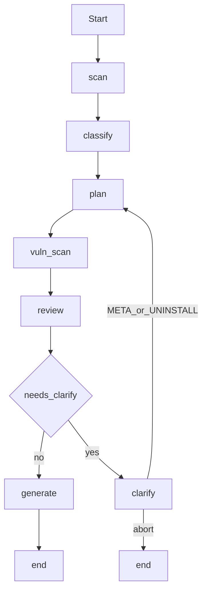

# Packaging AI — Recreate with VS Code + Claude Opus 4.8

This document converts `Project_Packaging.md` into a **recreation playbook** for building Packaging AI **outside Cursor**, using:

- **VS Code** (editor / terminal / Python extension)
- **Claude Opus 4.8** (agent that implements the code from this spec)

Use this file as the **primary prompt attachment** for Opus. Keep `Project_Packaging.md` as the detailed architecture reference if needed; this file is optimized for **greenfield rebuild**.

**Last aligned with:** Packaging AI v1.0 (LangGraph: `scan → classify → plan → vuln_scan → review → clarify → generate`).

---

## 0. How to use this with Opus 4.8 in VS Code

### Recommended workflow

1. Create an empty folder, e.g. `D:\DEV\Projects\Packaging_AI`
2. Open it in **VS Code**
3. Ensure **Python 3.11+** is installed (3.13 OK)
4. Attach or paste **this entire file** into your Opus 4.8 chat (Continue, Claude Code, Copilot Chat, etc.)
5. Give Opus the starter prompt in §0.1
6. Supply the **required assets** in §0.2 (Opus cannot invent PSADT toolkit or `dark.exe`)
7. Build in the **phased order** in §12 (do not ask Opus to generate everything in one shot)

### 0.1 Starter prompt (paste to Opus)

```text
You are implementing Packaging AI v1.0 from Project_Packaging_VSCode.md in this empty VS Code workspace.

Rules:
- Follow the functional requirements and module layout exactly.
- Prefer OpenAI (langchain-openai) + heuristic review. Make Cursor SDK review OPTIONAL (do not require cursor-sdk for a working install).
- Plan must be rule-based (no LLM planning).
- Use LangGraph for: scan → classify → plan → vuln_scan → review → clarify → generate.
- One Python file per LangGraph node under packaging_ai/graph/nodes/.
- Windows-only. Use pywin32 / msi.dll for MSI read; PowerShell for Authenticode.
- Do not invent Templates/AppDeployToolkit or Tools/WIX/dark.exe — I will copy those in.
- Implement phase by phase as I request. Start with Phase A (skeleton + config + models + CLI hello).

Confirm you understand, then implement Phase A.
```

### 0.2 Assets you must provide (not generated by Opus)

| Asset | Where to put it | Notes |
|-------|-----------------|--------|
| PSADT 3.10.2 toolkit | `Templates/AppDeployToolkit/` | Official PSADT 3.10.2 files |
| Script template | `Templates/Deploy-Application.ps1` | PSADT deploy template |
| Requirements rules | `Templates/PSADT_Requirements.md` | Copy from existing project or recreate from §7 |
| Footprint REG | `Templates/FootPrint/FootPrintTemplate.reg` | `HKLM\SOFTWARE\Package_Footprint` |
| WiX dark.exe | `Tools/WIX/dark.exe` | From WiX Toolset; gitignore bulk of WiX if desired |

Optional visual (not required to run): `docs/Packaging_AI_Workflow.png` — see `Project_Packaging.md`.

### 0.3 VS Code setup (human)

```powershell
cd D:\DEV\Projects\Packaging_AI
python -m venv .venv
.\.venv\Scripts\Activate.ps1
python -m pip install -U pip
```

In VS Code:
- Install **Python** extension
- Select interpreter: `.venv\Scripts\python.exe`
- Use integrated terminal with venv activated

Optional `.vscode/settings.json`:

```json
{
  "python.defaultInterpreterPath": ".venv\\Scripts\\python.exe",
  "python.terminal.activateEnvironment": true
}
```

---

## 1. Product overview (what to build)

Packaging AI is a **Python / LangGraph CLI** that produces **PSADT 3.10.2** packages from a folder of Windows installer media.

**Primary outcome:** given an **absolute** folder path:

1. Scan / classify installers (MSI / MST / EXE families, plus related media such as `.msp` / `.msix` / `.appx` when present)
2. For EXE: try **dark.exe**; if MSI found, package as MSI
3. Read MSI metadata (including Platform → `$appArch`)
4. Build rule-based **`Install_Plan`** (no LLM planning)
5. Vulnerability scan (SHA-256, Authenticode, NVD/OSV; optional cve-bin-tool)
6. Review against `Templates/PSADT_Requirements.md` (**OpenAI** if key set, else heuristic; Cursor SDK optional for this recreate)
7. Stamp **review `model` / `reviewer`** on `Install_Plan.json` and `Review_Report.json`; print them on the console
8. Clarify when confidence &lt; **0.75**, or EXE metadata / uninstall missing
9. Generate `output/{AppName}_{Version}/` with Package + logs (including `Vulnerability_Report.json` and `Packaging_AI.log`)

**Out of scope for v1.0:** web UI/API, LLM planning, VM testing, full MSI authoring library, reading EXE PE version resources (prompt instead).

---

## 2. Target repository layout

```
Packaging_AI/
  packaging_ai/
    __init__.py
    __main__.py                 # python -m packaging_ai
    cli.py                      # packaging-ai console entry
    config.py
    logutil.py
    models.py
    graph/
      state.py
      __init__.py              # LangGraph wiring + run_packaging()
      nodes/
        __init__.py
        scan.py
        classify.py
        plan.py
        vuln_scan.py
        review.py
        clarify.py
        generate.py
        routing.py
    installers/
      scan.py
      classify.py
      silent.py
      dark_extract.py
    msi/
      reader.py
      transform.py
    planning/
      plan.py
      review.py
      # OPTIONAL Cursor path only:
      # cursor_review_worker.py
      # cursor_windows_patch.py
    vuln/
      scan.py
      hashing.py
      signature.py
      matching.py
      nvd.py
      osv.py
      cve_bin.py
    psadt/
      generate.py
      requirements.py
  packaging_ai.config.json
  Templates/                   # you supply (not Template/)
    Deploy-Application.ps1
    AppDeployToolkit/
    PSADT_Requirements.md
    FootPrint/
      FootPrintTemplate.reg
  Tools/WIX/dark.exe           # you supply
  docs/                        # optional; workflow graphic
  requirements.txt
  pyproject.toml
  .gitignore
  README.md
  Project_Packaging_VSCode.md  # this file
```

**Notes:**
- Use **`Templates/`** only. An empty leftover `Template/` folder is obsolete.
- Prefer **OpenAI + heuristic** as the default review path so the project works without Cursor API keys. Document Cursor SDK as an optional extra.
- If you later want to **match the existing Packaging AI repo exactly**, switch review priority to Cursor → OpenAI → heuristic (see `Project_Packaging.md`).

---

## 3. Dependencies

### `requirements.txt` (recommended for VS Code recreate)

```text
langgraph>=1.2.0
langchain-core>=1.4.0
pydantic>=2.7.0
pywin32>=306
langchain-openai>=0.3.0
```

Optional:

```text
# cursor-sdk>=0.1.0          # only if implementing Cursor review
# cve-bin-tool>=3.0          # deeper binary CVE scan (not a pyproject extra)
```

**Note:** The current upstream repo ships both `cursor-sdk` and `langchain-openai` in `requirements.txt`. For a VS Code greenfield recreate, OpenAI-only is enough.

### `pyproject.toml`

- Package name: `packaging-ai`
- Version: `1.0.0`
- Console script: `packaging-ai = packaging_ai.cli:main`
- `requires-python = ">=3.11"`
- Core deps: `langgraph`, `langchain-core`, `pydantic`, `pywin32` (Windows)
- Optional extras (match upstream): `openai` (`langchain-openai`), `cursor` (`cursor-sdk`), `llm` (both)

Install:

```powershell
.\.venv\Scripts\pip.exe install -r requirements.txt
.\.venv\Scripts\pip.exe install -e .
# optional: .\.venv\Scripts\pip.exe install -e ".[openai]"
# optional: pip install cve-bin-tool
```

---

## 4. Configuration

Create `packaging_ai.config.json`:

```json
{
  "templates_dir": "Templates",
  "dark_exe": "Tools/WIX/dark.exe",
  "dark_cache_dir": ".cache/dark",
  "output_dir": "output",
  "confidence_threshold": 0.75,
  "model": "composer-2.5",
  "openai_model": "gpt-4o-mini",
  "openai_temperature": 0,
  "vuln_scan": true,
  "vuln_block_on_critical": false,
  "vuln_min_severity": "MEDIUM",
  "nvd_api_key": "",
  "log_level": "INFO",
  "log_file": "logs/packaging_ai.log"
}
```

| Key | Purpose |
|-----|---------|
| `templates_dir` | Canonical PSADT assets root |
| `dark_exe` | Path to WiX dark.exe |
| `dark_cache_dir` | dark extract working directory |
| `output_dir` | Default package output root |
| `confidence_threshold` | Clarify when score &lt; this (default **0.75**) |
| `model` | Cursor review model ID (only if Cursor path implemented) |
| `openai_model` | OpenAI review model |
| `openai_temperature` | OpenAI temperature (default `0`) |
| `vuln_scan` | Enable vulnerability assessment (default true) |
| `vuln_block_on_critical` | Abort when CRITICAL CVEs match (default false) |
| `vuln_min_severity` | Minimum severity to keep (`MEDIUM` default) |
| `nvd_api_key` | Optional NIST NVD API key (or `$env:NVD_API_KEY`) |
| `log_level` / `log_file` | Logging (`log_file` empty/`null` disables file log) |

Relative paths resolve from the project root.

Env overrides:

- `PACKAGING_AI_CONFIG`
- `OPENAI_API_KEY`, `PACKAGING_AI_OPENAI_MODEL`, `PACKAGING_AI_OPENAI_TEMPERATURE`
- `NVD_API_KEY`
- `PACKAGING_AI_VULN_SCAN`, `PACKAGING_AI_VULN_BLOCK_ON_CRITICAL`, `PACKAGING_AI_VULN_MIN_SEVERITY`
- `PACKAGING_AI_LOG_LEVEL`, `PACKAGING_AI_LOG_FILE`
- Optional Cursor: `CURSOR_API_KEY`, `PACKAGING_AI_MODEL`, `PACKAGING_AI_CURSOR_RUNTIME`, `PACKAGING_AI_CURSOR_TIMEOUT`

### CLI flags

| Flag | Behavior |
|------|----------|
| `folder` | Absolute path to installer media folder (required) |
| `-o` / `--output` | Output root (default: config `output_dir`) |
| `-y` / `--yes` | Auto-confirm soft low-confidence prompts; **cannot** skip EXE metadata or EXE uninstall prompts |
| `-v` / `--verbose` | DEBUG console logging |
| `--log-level` | `DEBUG` / `INFO` / `WARNING` / `ERROR` |
| `--log-file` | Override file log path (empty string disables) |
| `--version` | Print version |

### Review priority

**VS Code recreate (recommended):**

1. `OPENAI_API_KEY` → OpenAI ChatOpenAI review
2. (Optional) `CURSOR_API_KEY` → Cursor SDK
3. Heuristic review

**Upstream Packaging AI repo (if matching exactly):** `CURSOR_API_KEY` → `OPENAI_API_KEY` → heuristic.

On LLM/Cursor failure → fall back to heuristic and prepend a finding explaining the failure.

---

## 5. LangGraph flow



### Nodes (one file each)

| Node | Module | Responsibility |
|------|--------|----------------|
| scan | `nodes/scan.py` | Enumerate installer media |
| classify | `nodes/classify.py` | Family + dark.exe + MSI metadata |
| plan | `nodes/plan.py` | Rule-based Install_Plan |
| vuln_scan | `nodes/vuln_scan.py` | Hash, Authenticode, NVD/OSV (+ optional cve-bin-tool) |
| review | `nodes/review.py` | Score vs requirements; merge vuln findings; stamp model/reviewer |
| clarify | `nodes/clarify.py` | CLI `input()` prompts (order: META → uninstall → soft confirm) |
| generate | `nodes/generate.py` | Wipe prior output, write PSADT package + logs |
| routing | `nodes/routing.py` | `route_after_review` / `route_after_clarify` |

### Clarification protocol

| Trigger | Prompt | Stored | `-y` skip? |
|---------|--------|--------|------------|
| EXE missing Publisher/AppName/Version | `Publisher\|AppName\|Version` | `META:…` | **No** |
| EXE uninstall / invalid uninstall | paste path or `suggest` | `UNINSTALL_CMD:…` | **No** |
| Soft low confidence | `confirm` / text / `abort` | confirm or text | Yes |

Filename stem / default `1.0.0` do **not** count as found Publisher/AppName/Version.

Uninstall paste conversion:

- Input: `"C:\Program Files\Notepad++\uninstall.exe" /S`
- Output: `Execute-Process -Path "$envProgramFiles\Notepad++\uninstall.exe" -Parameters "/S" -WindowStyle Hidden`
- Also map `C:\Program Files (x86)\...` → `$envProgramFilesX86`

---

## 6. Data models (Pydantic)

Implement in `packaging_ai/models.py`:

- `InstallerFamily` enum (MSI, MST, Inno, NSIS, InstallShield, WiX Burn, Advanced Installer, Install4j, **Squirrel**, unknown EXE, …)
- `MsiMetadata` (include `platform`, `architecture`)
- `DetectedInstaller`
- `InstallPlan` (include `model`, `reviewer`, footprint fields, `deploy_script_name`, post steps, `source_exe` / `extracted_via_dark`)
- `ReviewReport` (`confidence_score`, `findings`, `approved`, `model`, `reviewer`, `raw_response`)
- `VulnerabilityReport` + `VulnerabilityFinding`, `FileHashInfo`, `SignatureInfo`
- `PackageArtifacts` (include `vulnerability_path`, `packaging_log_path`)

### `Install_Plan.json` — key fields

| Field | Notes |
|-------|--------|
| `app_vendor` / `app_name` / `app_version` / `app_arch` / `app_lang` | Package metadata; MSI arch from Platform |
| `primary_installer` / `primary_family` | Selected media |
| `source_exe` / `extracted_via_dark` | Set when dark.exe produced the MSI |
| `transforms` / `footprint_mst_name` | Existing MST or planned footprint MST name |
| `footprint_reg_name` | Vendor+AppName (no separator) |
| `deploy_script_name` | Planned `{Publisher}_{AppName}_{Version}_001.ps1` |
| `install_command` / `uninstall_command` | PSADT commands |
| `post_install_steps` / `post_uninstall_steps` | EXE footprint Set/Remove-RegistryKey |
| `model` / `reviewer` | Stamped after review |
| `assumptions` / `open_questions` | Audit trail |

### `Review_Report.json` — key fields

| Field | Notes |
|-------|--------|
| `confidence_score` | Float 0–1; empty LLM findings with no requirements issues → force **1.0** |
| `findings` | Issue strings |
| `approved` | True when score ≥ threshold and hard gates pass |
| `model` / `reviewer` | e.g. `gpt-4o-mini` / `openai`, or `heuristic` |
| `raw_response` | Raw model text when LLM used |

---

## 7. Packaging rules (must enforce)

Authoritative detail: `Templates/PSADT_Requirements.md` (recreate if missing).

### Script naming
- MSI and EXE: `{Publisher}_{AppName}_{Version}_001.ps1`
- Sanitize invalid Windows filename characters

### Paths / commands
- Media at **Package root**; `$scriptDirectory\...` only (never `Files/`, `$dirFiles`, `$dirApp`)
- MSI: `Execute-MSI`; no `/qn` `/norestart` `/l*v` on `-Parameters` (use toolkit config XML)
- MSI uninstall: `Execute-MSI -Action Uninstall -Path "{PRODUCT-CODE}"` when ProductCode known
- Uninstall mandatory; no TODO placeholders
- No hardcoded `C:\Program Files\...`

### Application variables
- Must set `$appVendor`, `$appName`, `$appVersion`, `$appLang` (default `EN`), `$appRevision`, `$appScriptVersion`, `$appScriptDate`, `$appScriptAuthor` (default `Packaging AI`)

### `$appArch`
- MSI: `Intel`→`x86`, `x64`/`Intel64`→`x64`, `Arm64`→`ARM64`
- EXE: filename hints when possible; otherwise empty

### Footprint
- **MSI without MST:** generate footprint MST from REG template; 32-bit vs 64-bit component rules; no `Wow6432Node` in MSI key path; do not leave `.reg` in `Package/`
- **EXE:** Post-Install `Set-RegistryKey` / Post-Uninstall `Remove-RegistryKey`; x86 adds `-Wow6432Node`

### EXE silent / log defaults

| Family | Silent | Log |
|--------|--------|-----|
| Inno | `/VERYSILENT /SUPPRESSMSGBOXES /NORESTART /SP-` | `/LOG="{LOG}"` |
| NSIS | `/S` | none |
| InstallShield | `/s /v"/qn"` | `/f2"{LOG}"` |
| WiX Burn | `/quiet /norestart` | `/log "{LOG}"` |
| Advanced Installer | `/qn` | `/log "{LOG}"` |
| Install4j | `-q` | `-Dinstall4j.alternativeLogfile={LOG}` |
| Squirrel | `--silent` | none |

Default log path token: `$configToolkitLogDir\$($appName)_$($appVersion)_Install.log`

### dark.exe
```text
dark.exe -nologo -x <extract_dir> -out <out.wxs> <installer.exe>
```
Prefer largest extracted MSI; on failure continue as EXE. Cache under `.cache/dark/`.

### Review scoring
- Empty findings + no requirements issues → force confidence **1.0**
- Missing uninstall / incomplete EXE metadata → hard gates (confidence capped; clarify required)
- On LLM failure → heuristic + finding explaining failure

---

## 8. Outputs

```
output/{AppName}_{Version}/
  Package/
    {Publisher}_{App}_{Ver}_001.ps1
    AppDeployToolkit/
    {installer media}
    {FootPrint}.mst          # if needed
  logs/
    Install_Plan.json
    Review_Report.json
    Vulnerability_Report.json
    Packaging_AI.log
    PSADT_Requirements.md
```

Clean rebuild: delete existing `{App}_{Ver}/` before regenerate.

Per-package log: buffer the run and write `logs/Packaging_AI.log` at generate time.

### Console summary (CLI)

After a successful run, print at least:

- `Confidence: {score}`
- `Review model: {model} ({reviewer})` when known
- Findings / vulnerability summary (hashes, signatures)
- Install_Plan summary: App, Primary, Family, Install, **Model**
- Package paths: Package, Script, Logs, Install_Plan, Review, Requirements, Vulnerabilities, Packaging log, Footprint MST

---

## 9. Vulnerability scan requirements

When `vuln_scan` is true:

1. SHA-256 of primary installer (+ source EXE if dark-extracted)
2. Authenticode via PowerShell `Get-AuthenticodeSignature`
3. NVD 2.0 (`services.nvd.nist.gov`) — version-range filtered (ignore wildcard CPE with no range)
4. OSV (`api.osv.dev`)
5. Optional `cve-bin-tool` — resolve from **venv Scripts**, not only PATH

Merge findings into review; soft confidence penalty as appropriate. Abort only when `vuln_block_on_critical` is true and CRITICAL findings exist.

Network allowlist: `services.nvd.nist.gov`, `api.osv.dev` (HTTPS 443).

Disable with `"vuln_scan": false` or `$env:PACKAGING_AI_VULN_SCAN=false`.

---

## 10. Logging

- Module: `packaging_ai/logutil.py` — `setup_logging`, `get_logger`, run capture → package log
- Console + optional global `logs/packaging_ai.log`
- CLI: `-v`, `--log-level`, `--log-file`
- Keep clarify **prompts** as `print()`; log decisions with the logger
- Prefer the package `Packaging_AI.log` as the authoritative run record if the console display looks truncated

---

## 11. Functional requirements checklist (for Opus)

Opus must satisfy all of these before calling v1.0 “done”:

- [ ] FR-1 Folder scan (absolute path; at least `.msi`/`.mst`/`.exe`)
- [ ] FR-2 Primary selection (prefer MSI; secondary files)
- [ ] FR-3 EXE family classification (including Squirrel)
- [ ] FR-4 Silent/log resolution
- [ ] FR-5 / FR-5b MSI read + architecture
- [ ] FR-6 / FR-6b MSI/MST + footprint MST
- [ ] FR-6c dark extract
- [ ] FR-6d EXE footprint registry
- [ ] FR-7 Install_Plan completeness fields
- [ ] FR-7b model/reviewer on plan + review + CLI
- [ ] FR-7c Vulnerability report
- [ ] FR-8 Templates store
- [ ] FR-9 Package layout + clean rebuild
- [ ] FR-10 Template fill
- [ ] FR-11 Review (OpenAI / heuristic; Cursor optional for this recreate)
- [ ] FR-11b Cursor Windows (optional) — subprocess worker; cloud default; WinError 10038 bridge patch
- [ ] FR-12 / 12b / 12c Confidence + EXE metadata + uninstall gates
- [ ] FR-13 Thin MSI reader/transform interface (swap-ready for future MSI library)
- [ ] FR-14 Script naming

---

## 12. Build phases (give Opus one phase at a time)

### Phase A — Skeleton
- `pyproject.toml`, `requirements.txt`, `.gitignore`
- `packaging_ai/config.py`, `models.py`, `logutil.py`
- `cli.py` / `__main__.py` that parses absolute folder and prints hello
- `packaging_ai.config.json`

### Phase B — Scan / classify / silent / dark
- `installers/*`
- Wire `scan` + `classify` nodes
- dark.exe integration (skip gracefully if missing)

### Phase C — MSI read + plan
- `msi/reader.py`
- `planning/plan.py`
- `plan` node + Install_Plan JSON shape

### Phase D — Review + clarify
- `planning/review.py` (OpenAI + heuristic)
- `review` + `clarify` + routing
- Confidence threshold 0.75; hard gates

### Phase E — Generate PSADT package
- `psadt/generate.py`, `requirements.py`
- Footprint MST (`msi/transform.py`)
- EXE Set/Remove-RegistryKey
- Write logs artifacts

### Phase F — Vulnerability scan
- `vuln/*` + `vuln_scan` node between plan and review
- Config toggles; optional cve-bin-tool

### Phase G — Polish
- Per-package `Packaging_AI.log`
- README
- Optional Cursor review path (`cursor_review_worker` + Windows patch; cloud runtime default)
- Smoke-test with a real MSI/EXE folder

---

## 13. Acceptance tests (manual)

After Phases A–G, in VS Code terminal:

```powershell
$env:OPENAI_API_KEY = "sk-..."   # optional
packaging-ai "D:\absolute\path\to\installer\folder" -v
packaging-ai "D:\absolute\path\to\installer\folder" -o "D:\packages" -y
```

Expect:
- Package under `output/{App}_{Ver}/Package/`
- Logs include `Install_Plan.json`, `Review_Report.json`, `Packaging_AI.log`, `PSADT_Requirements.md`
- `Vulnerability_Report.json` when `vuln_scan` true
- Console shows Confidence, Review model, package paths
- EXE prompts for META + uninstall when needed (`-y` does not skip those)
- MSI without MST gets footprint MST
- Re-running the same app/version deletes and rebuilds the output folder

---

## 14. What differs from Cursor-based development

| Topic | This VS Code + Opus guide |
|-------|---------------------------|
| IDE | VS Code |
| Coding model | Claude Opus 4.8 (chat/agent) |
| Default review LLM | **OpenAI** (simpler than Cursor SDK) |
| Cursor SDK | Optional later |
| Spec file | This document |
| Assets | Human copies Templates + dark.exe |
| Matching upstream exactly | Use Cursor-first review + ship `cursor-sdk` in requirements (see `Project_Packaging.md`) |

Opus 4.8 is used to **write the Packaging AI code**. It is **not** the runtime review model unless you separately configure OpenAI/Cursor keys for packaging runs.

---

## 15. Assumptions

- Windows-only packaging target
- Absolute input folder path
- PSADT **3.10.2**
- Confidence threshold **0.75**
- Plan is deterministic; LLM used for review only
- CLI first; HTTP API / UI are later phases (Phase 3 in `Project_Packaging.md`)
- Future phases: MSI library (2), API/UI (3), LLM planning (4), VM auto-test (5)

---

## 16. Optional next prompt after Phase G

```text
Add a FastAPI job-based HTTP API (no IIS yet) that wraps run_packaging with
non-interactive clarification endpoints, per Project_Packaging.md Phase 3.
Keep the CLI working.
```
