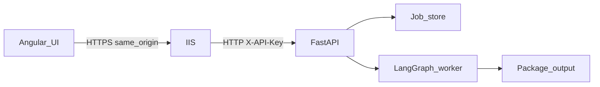
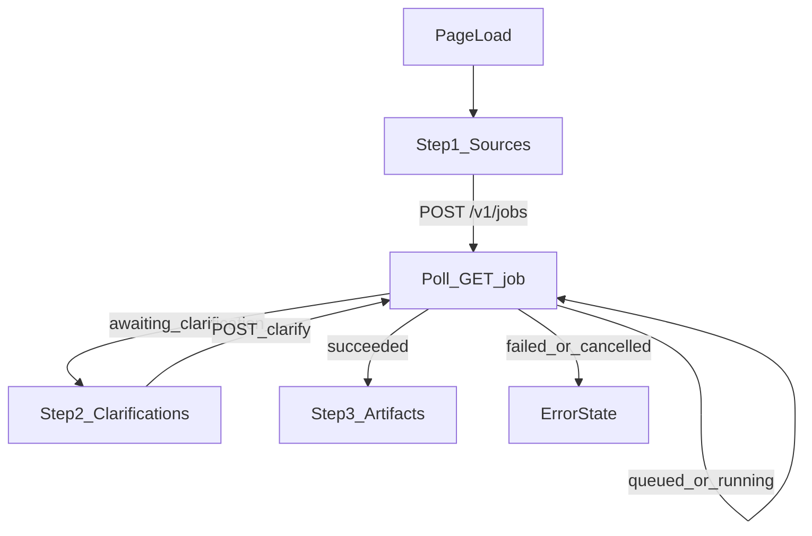

# Packaging AI Website — UI Plan

This document is the **authoritative UI plan** for a website that creates packaging jobs via the Packaging AI HTTP API. It does **not** implement the Angular app; use it as the guide for a later build pass.

**Parent specs:** [`Project_Packaging.md`](../Project_Packaging.md), [`API/Project_API.md`](../API/Project_API.md).  
**API runbook:** [`API/README.md`](../API/README.md).  
**API schemas:** [`packaging_ai/api/schemas.py`](../packaging_ai/api/schemas.py).  
**Status:** Implemented in [`UI/packaging-ai-ui/`](packaging-ai-ui/) (Angular 22.0.6). Runbook: [`packaging-ai-ui/README.md`](packaging-ai-ui/README.md).  
**Architecture diagram:** [`docs/Packaging_AI_Connections.png`](../docs/Packaging_AI_Connections.png).

---

## 1. Goal / scope

Build a browser-based operator UI that:

1. Prompts for the installer **sources location** (absolute input folder on the API host).
2. Creates a packaging job and polls until it needs input or finishes.
3. Collects **clarifications**, clearly labeling each as **Required** or **Optional**.
4. On success, shows the **package location** (`package_dir`) and related artifact paths.

| Topic | Choice |
|-------|--------|
| Framework | **Angular 22.0.6** |
| UX shape | Single linear wizard (not a multi-route dashboard) |
| Backend | Existing FastAPI API (`/v1/jobs`, clarify, artifacts) |
| Auth | `X-API-Key` injected by IIS (or Angular proxy); **not** entered in the UI |
| App location | [`UI/packaging-ai-ui/`](packaging-ai-ui/) |
| Local API bridge | Angular dev proxy (`proxy.conf.json`) — no CORS required for `ng serve` |

---

## 2. Prerequisites and install

### Required on the developer / operator machine

| Component | Notes |
|-----------|--------|
| **Node.js** | Active LTS compatible with Angular 22 (install from [nodejs.org](https://nodejs.org/)) |
| **npm** | Ships with Node |
| **Angular CLI** | Pin to **22.0.6** |
| **Packaging AI API** | Running and reachable (see [`API/README.md`](../API/README.md)) |
| **Shared paths** | `folder_path` / `output_dir` are paths on the **API server**, not browser uploads |

### Install Angular CLI 22.0.6

```powershell
node -v
npm -v
npm install -g @angular/cli@22.0.6
ng version
```

Confirm the CLI reports **22.0.6**.

### Create the app later (documented; not executed in this phase)

When scaffolding is approved, create the project under `UI/` (example):

```powershell
cd D:\DEV\Projects\Packaging_AI\UI
npx @angular/cli@22.0.6 new packaging-ai-ui --routing=false --style=css
cd packaging-ai-ui
ng serve
```

Default local UI: `http://localhost:4200/`.

### Run the API (local smoke)

```powershell
cd D:\DEV\Projects\Packaging_AI
.\.venv\Scripts\Activate.ps1
$env:PACKAGING_AI_API_KEYS = "dev-key-change-me"
$env:PACKAGING_AI_JOB_STORE = "memory"
python -m packaging_ai.api
```

Health check: `GET http://127.0.0.1:8000/health` (no API key).  
Job routes require header: `X-API-Key: <secret>`.

### CORS (local UI → API)

The Angular app on `localhost:4200` calling `http://127.0.0.1:8000` needs CORS enabled on the API (or an Angular/IIS proxy that same-origins the API). Document and enable CORS or a proxy when scaffolding; production typically serves the UI and API behind the same IIS host so the browser sees one origin.

### Important path rule

`folder_path` must be an **absolute directory that exists on the API host**. The UI is for operators who know server paths (or share a filesystem with the API), not for uploading installers from the browser.

---

## 3. Architecture



Diagram (image): [`docs/Packaging_AI_Connections.png`](../docs/Packaging_AI_Connections.png).

| Layer | Role |
|-------|------|
| Angular UI | Wizard: sources → progress → clarify → artifacts |
| IIS (prod) | TLS; reverse-proxy to uvicorn |
| FastAPI | Auth, job CRUD, clarify, artifacts |
| Worker | Runs packaging graph; pauses for clarification |
| Disk | Same `output/{App}_{Ver}/` layout as CLI |

### Client pattern

`POST /v1/jobs` → poll `GET /v1/jobs/{id}` until `awaiting_clarification` or terminal → if needed `POST /v1/jobs/{id}/clarify` → poll until `succeeded` / `failed` → `GET /v1/jobs/{id}/artifacts`.



---

## 4. Screen wireframes

One composition: a linear wizard. Show only the active step plus a compact status strip (job id + status) after create.

### Step 1 — Sources (on page load)

**Purpose:** Collect input and create the job.

| Field | Required | Maps to | Notes |
|-------|----------|---------|--------|
| Input folder | Yes | `folder_path` | Absolute path on API host |
| Output directory | No | `output_dir` | Absolute override; leave empty for API default |
| Custom requirements | No | `custom_requirements` | Free-text; LLM merges into plan step lists; unclear items pause for clarify |
| Auto-confirm soft findings | No | `auto_confirm` | Skips soft low-confidence confirm only; cannot skip META/uninstall/custom |

**CTA:** Create package → `POST /v1/jobs`.

**Auth:** Browser does not send `X-API-Key`. IIS (or local `proxy.conf.js`) adds it when forwarding to uvicorn.

**Empty / error states:**

- Missing folder → inline validation; do not call API.
- `400` (path not absolute / not a directory) → show API `detail`.
- `401` → proxy/IIS is not injecting a valid API key.

### Step 2 — Progress

**Purpose:** Wait while the job is `queued` or `running`.

- Poll `GET /v1/jobs/{id}` every **2 seconds**.
- Show: status, optional `plan_summary` (vendor / name / version / family), `confidence_score`, `review_findings`.
- **Cancel** → `POST /v1/jobs/{id}/cancel` when status allows; then show cancelled state.

### Step 3 — Clarifications

**Purpose:** Collect missing META / uninstall / soft confirm when `status === awaiting_clarification`.

Drive visibility from `clarification_needed`:

| Flag | UI control | Label | Body field |
|------|------------|-------|------------|
| `needs_meta` | Text: `Publisher\|AppName\|Version` | **Required** | `meta` |
| `needs_uninstall` | Textarea for uninstall line | **Required** | Prefer `uninstall_paste`; show `suggested_uninstall` as hint if set |
| `needs_custom_clarify` | Textarea for answers to custom-requirement questions | **Required** | `custom_answers` |
| `needs_soft_confirm` | Checkbox “Confirm and continue” | **Optional** | `confirm: true` |

Also show `open_questions` as read-only guidance when present. When `needs_custom_clarify` is true, label those questions **Required**.

**CTAs:**

- Submit → `POST /v1/jobs/{id}/clarify` with `action: "submit"` (and filled fields).
- Abort → same endpoint with `abort: true` (or `action: "abort"`).

After submit, return to Progress polling.

**Validation:** Do not submit if any **Required** field shown is empty. Optional soft confirm may be left unchecked only when the API still accepts the payload without it (if `needs_soft_confirm` is true, treat confirm as required for this pause even though soft confirm is skippable at job create via `auto_confirm`).

Clarification label rules for the operator:

- META, uninstall, and custom answers: always show badge **Required** when their `needs_*` flag is true.
- Soft confirm: show badge **Optional** when `needs_soft_confirm` is true (mirrors CLI `-y` / `auto_confirm` semantics at create time; at clarify pause the UI still presents the confirm control when requested).
- Custom clarify is never skipped by `auto_confirm`.

### Step 4 — Complete (succeeded)

**Purpose:** Show where the package was written.

On `succeeded`:

1. Call `GET /v1/jobs/{id}/artifacts`.
2. Lead with **Package location:** `package_dir`.
3. Secondary paths (collapsible or list): `deploy_script`, `logs_dir`, `install_plan_path`, `review_path`, `requirements_path`, `vulnerability_path`, `packaging_log_path`, `footprint_mst_path`.

**CTA:** Start another package → reset wizard to Step 1.

### Error state (failed / cancelled)

- Show `error` (if any) and final status.
- CTA: Start another package.

---

## 5. API mapping

Base URL (local example): `http://127.0.0.1:8000`.  
Production: same origin via IIS, or configured `apiBaseUrl`.

| UI action | Method / path | Auth | Request | Success response |
|-----------|---------------|------|---------|------------------|
| Health (optional) | `GET /health` | No | — | `status`, `version`, `job_store`, `sql_ok` |
| Create job | `POST /v1/jobs` | Yes | `{ folder_path, output_dir?, auto_confirm?, custom_requirements? }` | `202` → `{ id, status, created_at }` |
| Poll job | `GET /v1/jobs/{id}` | Yes | — | `JobResponse` (status, plan, clarification_needed, error, …) |
| Submit clarify | `POST /v1/jobs/{id}/clarify` | Yes | `{ action: "submit", meta?, uninstall_paste?, uninstall_command?, confirm?, custom_answers? }` | Updated `JobResponse` |
| Abort clarify | `POST /v1/jobs/{id}/clarify` | Yes | `{ abort: true }` or `{ action: "abort" }` | Updated `JobResponse` |
| Cancel | `POST /v1/jobs/{id}/cancel` | Yes | — | Updated `JobResponse` |
| Artifacts | `GET /v1/jobs/{id}/artifacts` | Yes | — | `ArtifactsResponse` paths |

### Create job body example

```json
{
  "folder_path": "D:\\absolute\\path\\to\\installer\\folder",
  "output_dir": null,
  "auto_confirm": false,
  "custom_requirements": "On uninstall, delete C:\\ProgramData\\MyApp\\cache"
}
```

### Clarify body example

```json
{
  "action": "submit",
  "meta": "Publisher|AppName|1.2.3",
  "uninstall_paste": "\"C:\\Program Files\\App\\uninstall.exe\" /S",
  "custom_answers": "Delete C:\\ProgramData\\MyApp\\cache on uninstall.",
  "confirm": true,
  "abort": false
}
```

### Expected HTTP errors

| Code | When | UI behavior |
|------|------|-------------|
| `400` | Invalid path / body | Show `detail` |
| `401` | Missing/invalid API key on proxied request | Fix IIS / Angular proxy key injection |
| `404` | Unknown job | Reset / start over |
| `409` | Clarify when not awaiting | Refresh job; show status |
| `500` | Server error | Show message; allow retry/new job |

---

## 6. Clarification rules

Mirror CLI / API behavior:

| Need | Skippable with `auto_confirm` at create? | UI label when shown |
|------|------------------------------------------|---------------------|
| Soft low-confidence confirm (`needs_soft_confirm`) | Yes | **Optional** |
| EXE metadata `Publisher\|AppName\|Version` (`needs_meta`) | **No** | **Required** |
| EXE uninstall (`needs_uninstall`) | **No** | **Required** |

- Prefer `uninstall_paste` in the UI; the API normalizes Program Files paths the same way as the CLI.
- `uninstall_command` is an advanced alternative (already-normalized PSADT command); omit from the default form unless needed later.
- Stored clarifications remain `META:…` and `UNINSTALL_CMD:…` on the server for plan rebuild.

Show a field **only** when its corresponding `needs_*` flag is `true`.

---

## 7. Config

Angular `environment` (or equivalent) keys:

| Key | Example | Purpose |
|-----|---------|---------|
| `apiBaseUrl` | `http://127.0.0.1:8000` | API origin (empty string if same-origin behind IIS) |
| `pollIntervalMs` | `2000` | Job status poll interval |

API key:

- **Not** stored in the Angular app or browser.
- Production: IIS URL Rewrite sets `HTTP_X_API_KEY` when proxying `/v1` (same value as `PACKAGING_AI_API_KEYS` on uvicorn).
- Local: [`proxy.conf.js`](packaging-ai-ui/proxy.conf.js) injects `X-API-Key` from `PACKAGING_AI_API_KEYS` (default `dev-key-change-me`).
- Protect who can open the IIS site; the key is a service secret, not a per-user login.

HTTP client: `Content-Type: application/json` only; no `X-API-Key` from the browser.

---

## 8. Non-goals (v1 UI)

- Browser file upload of installer media
- Job history / list page (`GET /v1/jobs` list can come later)
- Changing FastAPI, SQL schema, or LangGraph behavior
- Download endpoints for artifact bytes (paths only for v1)

---

## 9. Implemented app

Scaffold and wizard live under [`UI/packaging-ai-ui/`](packaging-ai-ui/). See that README for install, `ng serve` + proxy, and production build.
