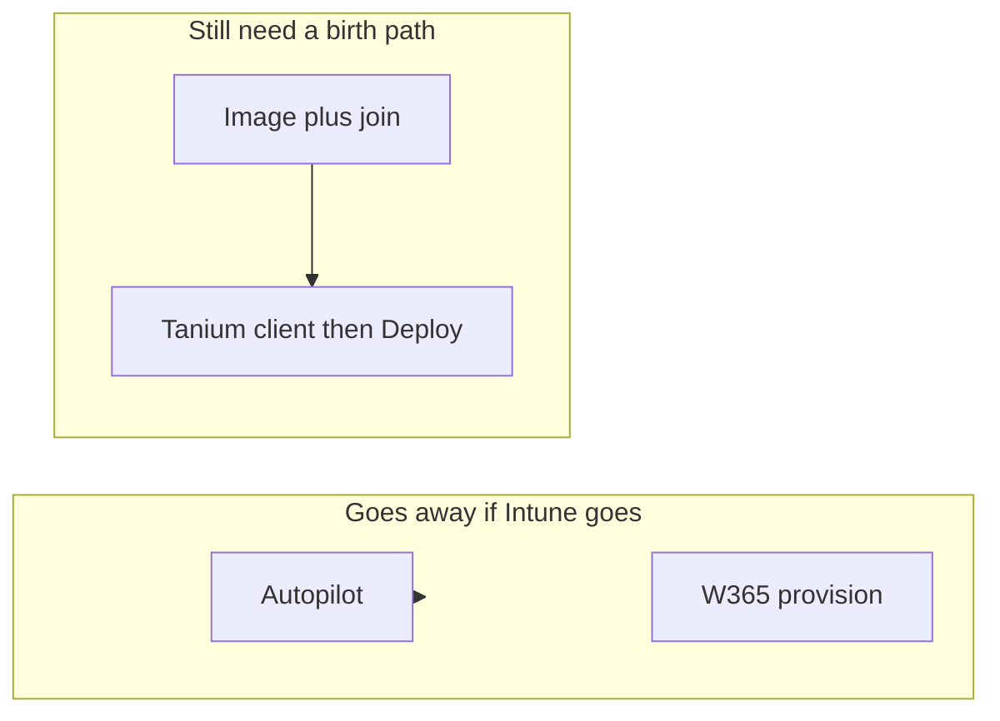

# Alternatives to Windows Autopilot

**Autopilot is not a Tanium feature and not an SCCM feature.** It is Entra + **Intune**: hardware hash, deployment profile, OOBE, ESP, Entra join.

If you take “almost everything” off Intune and SCCM, **Autopilot goes with Intune.** There is no switch in Tanium that births an Autopilot PC.

You still have to **build** machines. That is Job A ([task-sequences-and-ordered-apps.md](task-sequences-and-ordered-apps.md)). This file is what replaces Autopilot — and what does not.

Windows 365 is **not** Autopilot. Cloud PCs are created by Windows 365 + Intune provisioning. Drop Intune/W365 admin and you also drop “create Cloud PC.” Imaging alternatives below do not issue a Cloud PC. See [tanium-vs-intune-and-autopilot.md](tanium-vs-intune-and-autopilot.md).

## What Autopilot was doing

| Autopilot step | Must be replaced by |
|---|---|
| OEM hash / register device | Inventory of new hardware some other way (or stop caring) |
| OOBE “this is a company PC” | Boot media / PXE / OEM preload / technician |
| Entra join, no AD | **Drop it** (AD-join via imaging) **or** a provisioning package **or** keep thin Intune |
| ESP installs apps | Tanium client in the image or first boot, then Deploy |
| User-driven, ship-to-home | Harder without Autopilot — see “zero-touch” below |

You do **not** need Autopilot to domain-join on-prem. You already do that with an SCCM task sequence.

## Decision (this estate)

**Do not buy another MDM** (Workspace ONE, etc.) just to get “their Autopilot.” That is a second brain — same class of mistake as Cloudpager.

Realistic choices:

1. **Prove Tanium Provision** as the imaging owner (already licensed).
2. **OSDCloud or MDT + WDS** (or a thin leftover PXE) if Provision fails the lab.
3. **Keep a thin Intune only for Autopilot / W365** if you still need ship-to-home Entra OOBE or Cloud PCs. Everything else stays Tanium. That is a product carve-out, not “Intune is the engine.”

(1) or (2) is how on-prem AD machines get built after SCCM. (3) is the only way to keep *Autopilot itself*.

## Alternative A — Tanium Provision (try first)

**What it is:** Tanium’s imaging / provision module. Gold image or deployment, then software. Same agent you already want for Deploy.

**Fits:** on-prem and data-center builds; one vendor with Deploy/Patch.

**Does not give you:** Autopilot OOBE, OEM hardware-hash, ESP, Entra join as Microsoft implements it, ship-to-home with only a laptop in a box.

**Honest vs SCCM TS:** not a port of your task sequences (drivers, SMSTS resume, branching). Must pass the Job A lab: one desktop gold image, one server build.

**After the OS:** Tanium client is already there → Deploy PSADT bundles. Do not recreate the 5,000-app TS tail as a Provision script if a Deploy bundle will do.

**Use this if:** Provision lab passes and you accept technician/PXE/media instead of Autopilot OOBE.

## Alternative B — OSDCloud (or MDT + WDS)

**OSDCloud:** community PowerShell imaging. Boot USB/PXE, pull Windows, drivers, then a script. People leaving SCCM use it a lot. Can end by installing the Tanium client and handing off to Deploy.

**MDT + WDS:** Microsoft’s old free stack. Still works for AD-joined gold images. MDT is maintenance-mode; treat it as a known, boring factory, not a strategy.

**Fits:** replacing the **SCCM TS factory** you have today. 250k needs your process (driver store, rings, tech benches), not a miracle product.

**Does not give you:** Autopilot, Entra OOBE, Windows 365 create.

**Use this if:** Tanium Provision fails Job A and you still refuse Intune for imaging.

## Alternative C — Thin Intune, Autopilot only

Keep **Intune + Autopilot + (optional) Windows 365**. Nothing else.

- Autopilot profile: Entra join, ESP installs **Tanium client only**.
- No PSADT catalog in Intune.
- No Client Apps workload fight with SCCM.
- On-prem / servers: never Autopilot; Provision or OSDCloud.

**This is the only alternative that is still Autopilot.** It is not “moving off Intune.” It is **shrinking** Intune to a birthing service.

**Use this if:** ship-to-home, OEM, or Entra-only Cloud PCs stay a business requirement.

## Alternative D — Provisioning package (.ppkg)

Windows Configuration Designer: a USB package that can Entra-join and apply a few settings **without** Autopilot.

**Fits:** small bulk benches, kiosks, labs.

**Does not fit:** 250k as the factory. No ESP, weak app story, painful key/token rotation, not a TS replacement.

**Use this if:** a niche ring needs Entra join without Autopilot and without PXE. Not the estate path.

## Alternative E — OEM factory / preload

Dell / HP / Lenovo load a corporate image or Autopilot from the factory.

Without Intune, “OEM Autopilot” dies. What remains is **OEM-installed gold WIM** + your Tanium client. You still own driver/image versions. Works like a shipped SCCM image, not like Autopilot.

## What is not an alternative

| Idea | Why not |
|---|---|
| Tanium Deploy as the imager | Deploy needs an OS and a client. It does not PXE a bare disk. |
| Intune without Autopilot “somehow” | Enrollment still Intune; you already said you want off Intune. |
| Workspace ONE / another MDM Autopilot-like | Second UEM. Rejected. |
| Cloudpager / MSIX factory | Wrong problem. |
| “Windows 365 instead of Autopilot” | Different product. Still Microsoft cloud + Intune to *create* the PC. Does not build a physical laptop. |

## Zero-touch / ship-to-home

Autopilot’s real magic is **unbox, network, user, company PC** with no technician.

None of A, B, D, E match that at Autopilot quality:

- Provision / OSDCloud / MDT = **tech bench, PXE, USB, or OEM image**.
- Ship-to-home without Intune = preimaged OEM disk + user is a local/AD account, or you keep **thin Autopilot (C)**.

If leadership wants both “no Intune” and “Autopilot experience,” pick one. The document should say that in the steering meeting.

## Mapping your two populations

| Population | After SCCM / after Autopilot | Birth path |
|---|---|---|
| On-prem AD PC / server | Same as today, minus SCCM | **A** Provision or **B** OSDCloud/MDT |
| Physical PC that is Entra-only today via Autopilot | Either AD-join it like on-prem (**A/B**) or keep Entra OOBE (**C**) | Do not expect Tanium to Entra-join in OOBE |
| Windows 365 Cloud PC | Keep W365+Intune to create it, or drop Cloud PCs | Not an imaging tool’s job |

## Lab (do this before you announce “we dropped Autopilot”)

1. **Tanium Provision:** one desktop gold image, one server, Tanium client in, one PSADT from Deploy. Pass/fail Job A.
2. **OSDCloud or MDT** (backup): same two builds if (1) fails.
3. **Ship-to-home:** if the business still requires it, **C** stays — write Intune as Autopilot-only in the architecture, not as “we failed to leave Microsoft.”

Until (1) or (2) passes, SCCM TS stays the imaging owner. That is allowed; it just delays site teardown ([pilot-and-sunset.md](pilot-and-sunset.md)).
