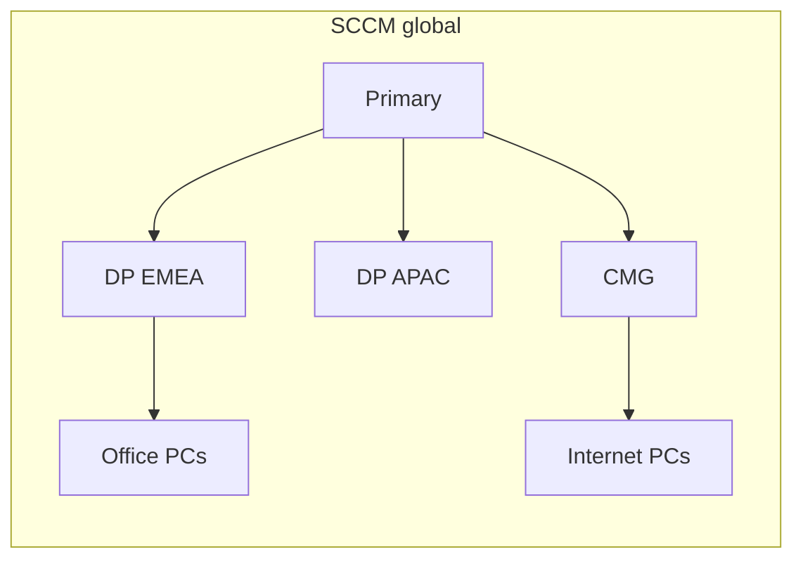
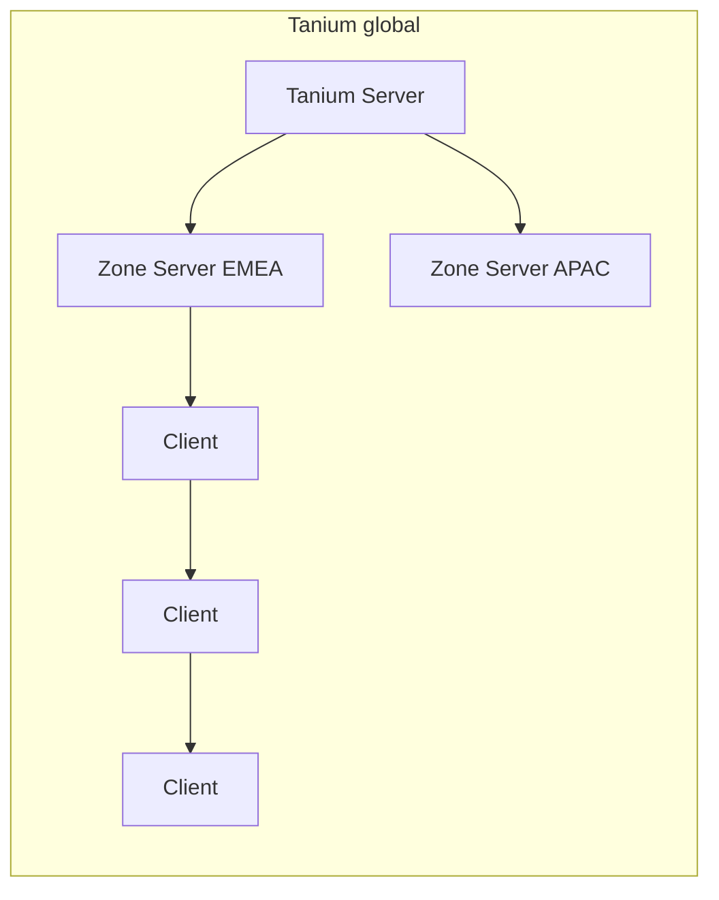

# Content distribution: SCCM vs Tanium (worldwide)

This estate has machines **all around the world**. That is a WAN problem, not a packaging problem. PSADT folders still have to cross oceans. The question is how many servers you run and who pays the first copy.

**Short answer:** Tanium is usually **better for a global fleet** because it does not need a distribution-point mesh or a CMG. Clients pass content along a **linear peer chain**. You still place a few **Zone Servers** by region and you still **seed or throttle** the first big package into a skinny site. SCCM wins only if you need “this office must have this package on a DP before anyone installs.”

Intune (for comparison): content in Azure, Delivery Optimization between peers, no DPs — and it still does not see your on-prem-only machines. Not the estate engine.

## How each one moves bits

### SCCM

- **Distribution points** hold the content library. You replicate every application revision to the DPs you pick.
- **Boundary groups** decide which DP a client uses. Wrong boundaries = WAN pulls or failures.
- **Peer cache / BranchCache / Delivery Optimization** reduce repeat WAN hits *after* someone nearby has the files — if you turned them on and they work.
- **CMG** is the internet path. You already know the pain (certs, cost, dual authority with Intune). Roaming users live here.
- Prestaged content, pulldates, rate limits: a lot of **explicit** control, and a lot of **servers and jobs** (distmgr, content status, failed DP copies).

Worldwide at 250k this looks like: many DPs (or shared DPs per region), slow-link offices, CMG for home/hotel, constant “content not on DP.”

### Tanium

- **No DP role.** There is no “distribute this application to 80 site servers.”
- Clients form a **linear chain** (and talk to a Tanium Server or **Zone Server**). Questions and **package files** hop neighbor to neighbor. The 2nd–Nth machine in an office usually takes content from a peer, not from HQ.
- **Zone Servers** sit in regional DMZs (typical: AMER / EMEA / APAC, plus extras for isolated or high-latency countries). Internet and Entra-only Autopilot/W365 PCs use these — this is the CMG analogue, but fewer boxes and not Azure-CMG.
- Client **cache** on disk: once a package has been through an office, peers reuse it.
- Bandwidth: subnet restrictions, throttles, “restricted”/satellite-style settings. Discipline required; the product will not magically spare a single PC on a VSAT link.

Worldwide at 250k this looks like: **a handful of Zone Servers**, correct client registration (so APAC does not chain through Virginia), and a **first-copy** plan for large PSADT.

## Comparison

| Topic | SCCM | Tanium |
|---|---|---|
| Servers you run for content | Many DPs + CMG (+ site roles) | Few Zone Servers + Tanium Server |
| Replicate 5,000 PSADT titles to every site | Yes, or clients pull WAN / CMG | No site-level replicate. Peers share. |
| Internet / hotel / home | CMG (painful here) | Zone Server(s) |
| Entra-only Autopilot / W365 | CMG or Intune DO | Zone Server path (must exist) |
| Second PC in the same office | DP or peer cache / DO if enabled | Chain / peer — **default** |
| First PC in a remote office | Assigned DP or WAN/CMG | Upstream peer or Zone Server — **this is the WAN hit** |
| “Must be on the local server before we deploy” | Native (content status) | Not native. Seed a client or accept first-hop WAN. |
| Control “this subnet uses this source” | Boundary groups | Zone Server + registration / location settings — coarser |
| WAN efficiency at scale | Good *if* DP + DO/peer cache are healthy | Usually better out of the box (chain) |
| Failure mode | Content missing on DP, bad boundary, CMG | Broken topology (“islands”), everyone hitting one Zone Server, huge sensor/package unthrottled |
| Operator pain | Distmgr, DP disk, CMG certs | Topology and Zone Server capacity, not 80 DP sync jobs |

**Winner for a global estate:** Tanium, if you invest in Zone Server placement and topology. **Winner for “pre-stage this WIM on the Lagos DP”:** SCCM.

## What “worldwide” actually breaks

### 1. The first copy still crosses the ocean

Tanium does not teleport a 3 GB Office PSADT into 60 countries. The **first** client in a site pulls from a Zone Server or an upstream peer. The next 200 in that building should not.

**Do:** start the deploy on a well-connected machine in-region (or pre-copy/seed cache if you have an official method), then open the rest of the computer group. **Do not:** required-deploy a giant title to 10,000 sparse VPN users at once with no throttle.

SCCM has the same first-copy physics unless the DP is already local.

### 2. Skinny links (plants, VSAT, small branches)

One machine, large package, satellite: **both products hurt.** SCCM: slow DP or BranchCache unused. Tanium: that client *is* the first hop.

Use throttles / off-hours / “don’t deploy 3 GB here.” Maintenance windows on servers still come from Patch, not from the chain.

### 3. Where the Zone Servers go

Treat Zone Servers like **regional CMGs**, not like one DP per office:

- At least one per major region (latency + blast radius).
- Isolated / OT / no-internet rings: a Zone Server or local path they can reach — same as a local DP today.
- W365 / Autopilot Entra PCs on the internet: if they cannot reach a Zone Server, Deploy is dead. That is a firewall/DNS design.

You should **not** need a Zone Server per office. If someone proposes that, they are rebuilding DPs.

### 4. Topology mistakes (the Tanium-specific outage)

If APAC clients register as if they were next to the US server, every question and every package hops the Pacific. SCCM equivalent: all clients in the wrong boundary group hitting the HQ DP.

Lab this: ask a question from a Sydney ring and from a São Paulo ring; confirm they are not all one hop from a single US box. Fix registration **before** the 5,000-title factory.

### 5. Huge content (Windows media, full Office, thick PSADT)

Same as SCCM: keep packages lean (PSADT `Files\` only what you need). Imaging WIMs are Job A (Provision / OSD), not Deploy. Do not push ISOs through the same path as a 40 MB agent.

## What you can stop doing

- Growing the **CMG** for app content.
- Adding **DPs** for new offices “so Tanium can work” — Tanium does not use them.
- Replicating every application revision to every site server.

## What you must still do

- Place **regional Zone Servers** and prove internet + W365 + hotel laptops can reach them.
- **Throttle / ring** first-time large deploys.
- Keep SCCM DPs only until that title has moved; do not dual-pull the same PSADT from a DP *and* Tanium.

## Lab (add to the worldwide pilot)

1. **Same office:** install a ~200–500 MB PSADT on machine 1, then machine 2–10. Confirm 2–10 do not pull the full payload from HQ (Tanium cache/peer counters or WAN graphs).
2. **Cross-region:** deploy from EMEA to an APAC ring. Measure first-client WAN vs the rest.
3. **Internet / Entra / W365:** one laptop off-VPN, one Cloud PC — both reach a Zone Server and finish Deploy.
4. **Skinny site:** one client on a known slow link — throttle holds; no surprise 3 GB midday.

If (1) or (3) fails, fix topology before you blame Deploy or PSADT.

## Score

| Need | Better fit |
|---|---|
| Fewer servers worldwide | **Tanium** |
| No CMG | **Tanium** |
| Default peer sharing in every office | **Tanium** |
| Guaranteed local replica before go-live | **SCCM** |
| Internet and Entra-only PCs | **Tanium Zone Server** (if placed) |
| First copy to a lonely overseas box | Tie — physics; design rings/throttles |
