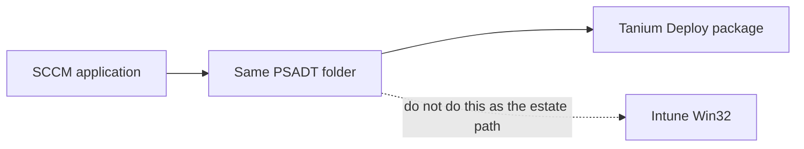

# Converting SCCM apps — Tanium does not go through Intune

**Short answer:** moving applications to Tanium does **not** require converting SCCM apps to Intune. That step is not in this design and must not be added.

What *is* required: **recreate** every surviving title as a Tanium Deploy package and **test it again on Tanium**. This estate’s payload is **always PSADT** — copy the whole toolkit folder, do not unwrap to a raw MSI. The SCCM application object does **not** move. There is no import. New package, new sensors, new computer groups — then a real install/uninstall proof on Tanium-managed machines before you drop the SCCM deployment.

That is not a Cloudpager/MSIX rebuild. It is also not a free conversion. Budget time per **Republish** title.

If someone on the program says “we have to get everything into Intune first,” they are describing a **different** project (Microsoft’s cloud-native path). That path fails this estate: on-prem machines Intune cannot see, servers, maintenance windows, 250k scale. See [usage.md](usage.md).



## What was already covered (and what was not)

| Question | Covered? | Where |
|---|---|---|
| Do we rebuild / Cloudpager / MSIX the 5,000 packages? | Yes — **no** | [usage.md](usage.md), [README.md](README.md) |
| Classify retire / catalog / republish | Yes — high level | [pilot-and-sunset.md](pilot-and-sunset.md) §2–3 |
| Must apps go SCCM → Intune → Tanium? | **No. That is wrong.** | This file |
| How to republish SCCM → Tanium Deploy, step by step | This file | Below |
| How SCCM → Intune Win32 is done (if someone still asks) | This file — **exception only**, not the plan | Bottom |

---

## Recreate and retest — this is the work

“Same package” means **same payload on disk**. It does **not** mean the SCCM app is trusted in Tanium.

Every title in the **Republish** bucket must:

1. **Be created again** in Tanium Deploy (package or bundle). Automation can type the command line; it cannot skip the object.
2. **Be tested again** under the Tanium client: applicability sensor, install, verification sensor, uninstall (if you ship one), reboot behavior, SYSTEM vs user context.
3. **Pass a written test** on a pilot ring before the SCCM deployment is removed.

SCCM success does not transfer. Different agent, different content path, different detection engine, different targeting. A silent switch that worked from a DP can fail when Tanium stages files or when the sensor is wrong.

Classify exists so you do **not** recreate-and-retest 5,000 objects. You still recreate-and-retest **every title you keep**.

### Minimum test per title (do not skip)

Run on at least one **clean** machine and one machine that **already has** the SCCM-installed version (upgrade / detect-already-present).

| Test | Pass |
|---|---|
| Applicability | Sensor true only on machines that should get it (OS, arch, prerequisite) |
| Already installed | Sensor true; Deploy does **not** run the installer again (or runs a no-op) |
| Fresh install | Exit code as designed; app works; verification sensor true |
| Uninstall | Command removes the app; sensor false |
| Context | SYSTEM vs user matches SCCM; per-user apps do not “succeed” only on the service account |
| Reboot | No surprise reboot; if a reboot is required, it matches the old deployment type |
| Timing | Completes inside the timeout; does not hang the Deploy queue |
| Ordered bundle (if any) | A then B then C; failure of A stops B |

Fail any row → fix the Tanium package/sensor; do **not** expand targeting and do **not** delete the SCCM deployment.

Pilot 20 titles first ([pilot-and-sunset.md](pilot-and-sunset.md) §1.1). That proves the factory. It does not waive per-title test on the rest of the republish pile.

## All packages are PSADT

The catalog is **PowerShell App Deployment Toolkit** end to end. Tanium does not install the inner MSI “instead of” PSADT. The unit of recreate is the **same toolkit folder** you deploy from SCCM.

That is good for a factory: one or two command-line shapes, same log path, same exit-code family. It is still recreate + retest. You do **not** rewrite `Deploy-Application.ps1` for 5,000 titles.

### What the payload is

Copy the entire content source, not just `Files\setup.exe`:

- `Deploy-Application.exe` / `Deploy-Application.ps1` (PSADT 3.x) **or** `Invoke-AppDeployToolkit.exe` (PSADT 4.x)
- `AppDeployToolkit\` (or v4 toolkit layout)
- `Files\`, `SupportFiles\`
- `AppDeployToolkitConfig.xml` (and any site XML)

If the estate is **mixed 3.x and 4.x**, the factory has **two** command templates. Do not assume one line fits all 5,000.

### Command lines (typical)

Use what SCCM already calls, plus **Silent** if today’s SCCM line relies on Software Center + ServiceUI for a UI.

PSADT 3.x (most estates):

```text
Deploy-Application.exe -DeploymentType Install -DeployMode Silent
Deploy-Application.exe -DeploymentType Uninstall -DeployMode Silent
```

PSADT 4.x:

```text
Invoke-AppDeployToolkit.exe -DeploymentType Install -DeployMode Silent
Invoke-AppDeployToolkit.exe -DeploymentType Uninstall -DeployMode Silent
```

Working directory must be the toolkit root (where the exe lives). Tanium must stage the **whole folder** and start the exe from that folder. A command that worked on a DP because the cwd was the package root will fail if Tanium starts from `C:\Windows\System32`.

### Silent vs the SCCM UI — the real Tanium change

| How it runs in SCCM today | What Tanium Deploy needs |
|---|---|
| Required, no UI, already `-DeployMode Silent` | Same command. Lowest risk. |
| Available in Software Center, user sees PSADT balloons / defer | Required Tanium deploys: **Silent**. Deferral is not a maintenance window. |
| `ServiceUI.exe` + `Deploy-Application.exe` so SYSTEM shows UI to the logged-on user | **Do not** keep ServiceUI on servers or on required unattended deploys. It waits for a session and will hang the queue. Interactive PC self-service is a separate design, not the default path. |

PSADT **CloseApps** / allow-defer / “defer up to N days” is **not** an SCCM collection MW and **not** a Tanium Patch window. For servers, Silent + close apps with a short timeout (or `-AllowDefer:$false`). User defer that returns PSADT **60012** (or equivalent) must be mapped in Tanium as **not success** — otherwise Deploy will mark the box green and never retry.

Do not edit 5,000 scripts to “make them Tanium.” Prefer the **command line** (`-DeployMode Silent`). Touch `Deploy-Application.ps1` only when the script itself hard-codes Interactive / ServiceUI and the command line cannot override it. That title is an exception, not a new packaging program.

### Exit codes and logs

Tanium must treat the same codes SCCM did:

| Code | Meaning (typical PSADT) | Tanium |
|---|---|---|
| 0 | Success | Success |
| 3010 / 1641 | Success, reboot | Success + reboot policy — match the old deployment type |
| 1638 | Already installed | Usually success (align with your SCCM return-code list) |
| 60001+ toolkit errors | Fail | Fail |
| 60012 (or your defer code) | User deferred | **Fail / retry** — not success |

On every test failure, read the PSADT log **before** blaming Tanium:

`C:\Windows\Logs\Software\` (classic) or the path in `AppDeployToolkitConfig.xml`.

If the log never appears, the exe never started (cwd, bitness, execution policy, files not staged). If the log shows a vendor MSI error, that is the inner installer — same as SCCM.

**Do not RDP to collect it.** In Tanium, question the failed computer group for the last N lines of that log (see [comparison-sccm-vs-tanium.md](comparison-sccm-vs-tanium.md) — Client deployment logs). Build that sensor in the 20-app lab. That is the operational upgrade over SCCM/Intune log pain. Bound the sensor (last N lines). Copy the full file to a share only for the few boxes you need to archive.

### Extra test rows (PSADT)

Add these to the minimum test table for **every** title:

| Test | Pass |
|---|---|
| Silent | No dialog, no ServiceUI hang, no wait-for-user on a server or a locked workstation |
| Log | A new PSADT log exists; install line matches the Tanium command |
| Exit mapping | 3010 / defer / already-installed match the table above |
| Working directory | Toolkit finds `AppDeployToolkit` and `Files` (no “cannot find script” / missing MSI) |

### What you copy vs what you recreate

| Keep from SCCM (do not change) | Recreate in Tanium |
|---|---|
| Whole PSADT folder (toolkit + Files + SupportFiles) | Tanium package pointing at that folder |
| Install / uninstall = `Deploy-Application.exe` (or v4 exe) | Same exe; add `-DeployMode Silent` if SCCM depended on UI |
| Inner MSI / EXE inside `Files\` | Leave it — do not unwrap |
| MSI product code | Sensor: product code present |
| File / registry detection | Sensor: file version or registry value |
| Custom detection script | Sensor (same logic, Tanium sensor format) |
| Collection membership rules | Computer group = saved question |
| Required vs available | Deploy policy / self-service (if you use it) |
| Dependencies | Package dependency or **bundle** (see [task-sequences-and-ordered-apps.md](task-sequences-and-ordered-apps.md)) |
| Supersedence chain | Usually **retire** old versions; do not recreate a 6-level chain |
| Global conditions / requirement forests | Computer group filters (OS, architecture, disk). Deep forests are the hard titles — human review. |

User vs system context: set the Tanium package to run as the same account the SCCM deployment type used (SYSTEM vs user). Wrong context is a common silent failure.

### Step 1 — Export metadata from ConfigMgr

Do not inventory the console by hand. Pull from **AdminService** (`https://<SMSProvider>/AdminService/wmi/`) or the SMS Provider (WMI).

Per application / deployment type, export at least:

- `LocalizedDisplayName`, publisher, version
- Content source path (or Content Library object ID → resolve to source)
- `InstallCommandLine`, `UninstallCommandLine` (expect `Deploy-Application.exe` / `Invoke-AppDeployToolkit.exe`; note ServiceUI and DeployMode)
- PSADT major version (3.x vs 4.x) if you can detect it from the folder
- Detection: MSI product code **or** clause XML **or** script (SCCM detection — not only what is inside `Deploy-Application.ps1`)
- Execution context (user / system), disk space, max runtime
- Dependencies, superseded apps
- Deployments: collection ID/name, required vs available, purpose
- Last success count (or equivalent) for classify

Write one row per **deployment type**, not only per application (one SCCM app can have several types).

### Step 2 — Classify (before any Tanium package)

Same buckets as [pilot-and-sunset.md](pilot-and-sunset.md):

1. **Retire** — dead, superseded, no installs. Stop.
2. **Catalog** — Chrome-class already in Tanium Patch / vendor feed. Stop. Do not create a Deploy package *and* do not create an Intune app.
3. **Republish** — LOB / custom. Continue.

### Step 3 — Stage the same content

Copy the SCCM **content source** (or the extracted Content Library payload) to a Tanium-reachable share or into the package work folder.

- Copy the **entire PSADT tree**, not only `Files\`.
- Do not re-wrap as `.intunewin`.
- Do not convert to MSIX / Cloudpager.
- Do not unwrap to a raw MSI “to make Tanium simpler.”

### Step 4 — Create the Tanium Deploy package

For each Republish row:

1. Upload / reference the files in **Tanium Deploy**.
2. **Install command** = SCCM install command, with `-DeployMode Silent` if the SCCM line was interactive / ServiceUI. Working directory = toolkit root.
3. **Uninstall command** = same exe, `-DeploymentType Uninstall -DeployMode Silent`.
4. Timeouts ≈ SCCM max runtime.
5. Reboot behavior: match SCCM (`No / ConfigMgr reboot / hard reboot`). Mid-sequence reboot stacks are Job B hard — see [task-sequences-and-ordered-apps.md](task-sequences-and-ordered-apps.md).
6. Applicability + success = **sensors** (next step).

### Step 5 — Map detection to sensors

| SCCM detection | Tanium sensor |
|---|---|
| Windows Installer product code | Query add/remove programs or `MsiEnumRelatedProducts` / WMI `Win32_Product` is slow — prefer uninstall registry + product code |
| File exists / version | File version sensor on that path |
| Registry key / value | Registry sensor |
| Custom script | Port the script to a Tanium sensor; keep the same true/false meaning |

**Applicability** (should this machine get the app?) and **verification** (did it install?) are often two sensors. Do not use the same check for both if SCCM had a requirement rule plus a detection rule.

Pilot the mapping on 20 titles before factory scale. Detection is the #1 failure mode — not the EXE.

### Step 6 — Targeting (collections → computer groups)

SCCM collections do not exist in Tanium. Recreate the **rule**, not the folder tree:

- AD group / OU → question on `AD groups` or distinguished name
- Hardware (laptop, RAM, OS build) → existing sensors
- “Installed app X” → software sensor
- Include/exclude collections → compose saved questions (include minus exclude)

Direct membership collections become a static computer group or an AD group you already own. Do not invent 5,000 one-off groups.

### Step 7 — Ordered stacks (optional)

If the SCCM object was a **task sequence** that only installed apps in order (no PXE, no mid-chain reboot):

- One Deploy **bundle**
- Package dependencies: A before B before C
- Same payloads as the TS Install Application steps

If the TS reboots mid-chain, branches, or images a disk — that is **not** this procedure. See [task-sequences-and-ordered-apps.md](task-sequences-and-ordered-apps.md).

### Step 8 — Test, then cut over (never dual-deploy)

1. Deploy the new Tanium package to a **pilot computer group** (old collection ∩ lab ring).
2. Run the **minimum test per title** above. Recreated is not done. Tested on Tanium is done.
3. Expand the computer group to the full equivalent of the collection only after that test is signed.
4. **Remove the SCCM deployment** the same day the Tanium deploy becomes required. Two engines installing the same product is how you get version fights and false failures.
5. Leave the SCCM **application object** read-only until the title is stable in production, then retire it from the catalog. Content stays in the archive share.

### Factory (repeatable, not a cottage industry)

Automation recommended after the 20-app lab passes:

`ConfigMgr export → classify CSV → stage content → create/update Tanium package + sensors → attach computer group`

Humans only on: custom detection, user-context installs, requirement forests, TS-based installers.

Do **not** insert Intune in that pipeline.

---

## Path we do not use: SCCM → Intune Win32

This is what people mean by “convert SCCM apps to Intune.” It is **Microsoft’s** migration pattern. It is **not** required for Tanium. It does not reach on-prem non-enrolled devices or servers.

Documented here so the program can say **no** with a precise alternative — and so a **single enrolled-PC exception** (if leadership forces Autopilot ESP for a small ring) is done correctly instead of becoming the estate path.

### When Intune Win32 is allowed

- **Never** as the 250k / server / on-prem deployer.
- **Only** if a named, small ring of **already Intune-enrolled** PCs must get an app during Autopilot/ESP **and** Tanium cannot run yet (no Tanium client in ESP). That is an exception with an owner and an end date — not “convert the catalog.”

### How the conversion is done (if that exception is approved)

This is **republish**, same as Tanium — still not a Cloudpager rebuild.

1. **Export** the same SCCM metadata and content as Step 1–3 above.
2. **Wrap** the folder with the [Win32 Content Prep Tool](https://learn.microsoft.com/en-us/intune/intune-service/apps/apps-win32-prepare) (`IntuneWinAppUtil.exe`): input folder + setup file → `.intunewin`. That is a zip for Intune transport, not a new package format.
3. **Create** the Win32 app in Intune (portal or Microsoft Graph):
   - Install / uninstall command = SCCM command lines
   - Install context = system vs user (match SCCM)
   - Return codes = SCCM restart codes
4. **Detection rules**
   - MSI product code → Intune MSI detection
   - File / registry → Intune file/registry rules
   - Script → Intune custom detection script (exit 0 + stdout)
5. **Requirements** — min OS, architecture (map global conditions you still care about; drop the rest).
6. **Assignments** — collections become **Entra ID groups**. There is no collection export. Build groups from the same AD rules or device filters.
7. **Supersedence / dependencies** — Intune has both; they are thinner than ConfigMgr. Prefer retire + one current version.
8. **Do not** assign the same title in Intune and Tanium and SCCM.

There is no supported “SCCM application → Intune” one-click that preserves collections, MW, or task sequences. Community / partner tools only automate wrap + Graph create. You still classify and you still re-do targeting.

### Why this is not the Tanium project

| If you convert the catalog to Intune… | What happens here |
|---|---|
| On-prem PCs not enrolled | Never get the app |
| Servers | Not a real Intune MW story |
| Then “also deploy with Tanium” | You converted **twice** and dual-authority is back |
| CMG + Intune Client Apps | The mess already rejected |

**Estate rule:** SCCM application → Tanium Deploy. Intune Win32 is not a station on that line.

---

## Checklist (operator)

- [ ] Export SCCM apps (metadata + source path), one row per deployment type
- [ ] Classify: retire / catalog / republish
- [ ] Each Republish title is **created again** in Tanium Deploy from the **whole PSADT folder** (not an SCCM import, not a raw MSI)
- [ ] Command is Silent; ServiceUI not used on servers / required unattended
- [ ] Each title is **tested again** on Tanium (tables above) on a clean box and an already-installed box; PSADT log exists
- [ ] Detection mapped to sensors and proven on a pilot ring
- [ ] Collections re-expressed as computer groups
- [ ] Ordered no-reboot TS → bundle + dependencies, then tested as a chain
- [ ] SCCM deployment removed only after the Tanium test is signed
- [ ] No `.intunewin` factory for the estate catalog
- [ ] No “convert to Intune first” gate on the Tanium program
