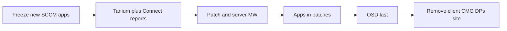

# Pilot, republish factory, Intune boundary, SCCM sunset

Do not start a 5,000-app migration on slides. Run a time-boxed lab on a **server ring** and a **PC ring**. No-go on **Deploy** or **server maintenance windows** means Tanium stays an inventory / security / script tool — not the SCCM replacement.

## 1. Go / no-go lab (Tanium vs SCCM)

### 1.1 Deploy — 20 real applications

- All titles are **PSADT**. Mix *inside* the toolkit: MSI, EXE, script installs, **one dependency pair**. Include at least one that uses ServiceUI / interactive mode in SCCM today (those are the ones that break if you forget `-DeployMode Silent`).
- Same content, same silent / uninstall switches. Wrap as Tanium packages. Verify detect → install → uninstall via sensors.
- **No** Cloudpager, **no** MSIX, **no** new runtime.
- Pass: 20/20 install and detect correctly; uninstall where we have a command.
- Fail: systematic detection failures or “needs a TS to install” for ordinary silent apps.

### 1.2 Patch and maintenance windows (servers)

- Pick production-like server collections that already have SCCM windows.
- Re-express the same calendar in **Tanium Patch** (windows + blackouts + reboot control).
- Prove: no install or reboot outside the window, including **missed-window** behavior, overlapping windows, and clustered / HA boxes.
- Pass: server owners sign that the contract holds.
- Fail: Tanium is not the SCCM replacement for servers. Stop and decide (fix Patch design vs reopen BigFix vs keep SCCM for server patch).

### 1.3 Reporting

- List the **15 SCCM reports operators actually open** (not the full SSRS catalog).
- Recreate each with Trends / Reporting or **Connect → warehouse** (Splunk, Sentinel, Snowflake, SQL).
- Pass: all 15 exist without the ConfigMgr console.
- Fail if **three or more** are impossible: warehouse engineering, or a dated exception for a read-only SCCM SQL replica, or BigFix — do not “hope Intune reporting improves.”

### 1.4 CMScript / Run Script → Interact

- Take the **approved** Run Script library (not every unsigned one-off).
- Map each to a Tanium package + the **same approval / RBAC**.
- Prove on a PC ring **and** a server ring: question → who matches → Deploy Action → output back.
- This workload should move **first**. It sells Tanium to operators.

### 1.5 Ordered apps (Job B)

- One real TS: **8+ apps in order**, no mid-chain reboot → Deploy bundle + dependencies.
- One real TS that **reboots mid-chain**. If resume fails, those TSes stay on an orchestrator (Job A). That does not block standalone Application move.
- Details: [task-sequences-and-ordered-apps.md](task-sequences-and-ordered-apps.md).

### 1.6 OSD (Job A)

- One desktop gold image and one server build with Tanium Provision **or** MDT / OSDCloud.
- If it cannot replace the TS, **imaging stays a separate product** and the sunset date says so.

### Kill / go

| Result | Action |
|---|---|
| Deploy **or** server MW fails | Tanium is **not** the replacement. Do not force 5,000 apps into it. |
| Reporting fails (3+ reports) | Pause sunset of SCCM reports; fund warehouse or accept a replica exception. |
| Job B simple passes, Job B hard fails | Move standalone apps + simple bundles; keep an orchestrator for reboot TSes. |
| Job A fails | SCCM (or MDT/OSDCloud) remains for imaging; other workloads can still drain. |
| All of 1.1–1.4 pass | Proceed to classify and republish. |

## 2. Classify 5,000 packages (do not rebuild)

Export from ConfigMgr (AdminService / SMS Provider), not from memory:

- Name, publisher, version
- Install and uninstall command lines
- Detection method
- Dependencies and supersedence
- Deployments (collections, required vs available)
- Last successful install (or equivalent)

Then **one bucket per title**:

| Bucket | Rule | Destination |
|---|---|---|
| **Retire** | No successful install in N months, superseded, or replaced | Do not migrate |
| **Catalog** | Commodity (Chrome-class) already owned by Tanium Patch / vendor feed / existing catalog | Do **not** migrate the SCCM package. Do **not** stand up Intune Enterprise App Management as the estate catalog. |
| **Republish** | Line-of-business / custom / licensed | Tanium Deploy, **same content** — still **recreate + retest** each title |

Expect the republish pile to be far smaller than 5,000. That is how this stays off a “rebuild every package” track. It does **not** skip creating and testing the titles you keep.

Humans review exceptions (weird detection, dual-purpose uninstall, user vs system context). Every Republish title still gets a Tanium install/uninstall proof. See [converting-sccm-apps.md](converting-sccm-apps.md).

## 3. Republish factory (SCCM → Tanium Deploy)

Step-by-step (export, sensors, collections → computer groups, cutover): [converting-sccm-apps.md](converting-sccm-apps.md).

Not Intune Win32. Not `.intunewin`. Not Graph upsert into Intune. You do **not** convert SCCM apps to Intune in order to use Tanium.

For each **Republish** title:

1. Copy the existing content source (do not rebuild).
2. Create a Tanium Deploy package: same install / uninstall command lines.
3. Map detection to **sensors** (MSI product code is mechanical; file/registry map 1:1; script detection becomes a sensor).
4. Map collections → computer groups (saved questions). That is assignment work, not package work.
5. Preserve dependencies where they still matter as **package dependencies** or a **bundle**.
6. **Test again on Tanium** (clean install + already-installed). Recreated is not done.
7. After the title is healthy in Tanium, **delete the SCCM deployment**. Never dual-deploy.

Pipeline shape: ConfigMgr export → classify → create Tanium package → **test** → cut over. Automation can type the command line; it cannot skip recreate or the Tanium test. Humans on exceptions **and** test sign-off.

**Do not** build a ConfigMgr-to-Intune Win32 pipeline. Intune is not the engine. See section 5.

## 4. Map maintenance windows (especially servers)

- Inventory SCCM collection MWs that server owners treat as contracts.
- Re-express each in Tanium Patch (window + blackout + reboot policy).
- Deploy / Interact **do not inherit** those windows automatically — schedule those actions onto the same calendar or they will violate the contract.
- Prove missed-window and overlap behavior in the lab (section 1.2) before any production server ring leaves SCCM SUP.

## 5. Intune boundary (hard)

Intune stays **MDM / compliance on enrolled PCs only**.

| Allowed | Forbidden |
|---|---|
| Device compliance, configuration profiles, enrollment, Autopilot, Windows 365 **provisioning** | Client Apps / Win32 as the estate catalog (Tanium client bootstrap during ESP is OK) |
| | Server patch |
| | Maintenance-window authority |
| | “Wait for Intune server support” as the SCCM exit plan |
| | CMG + Intune as equal app authorities |
| | Connected Cache as a substitute for finishing Tanium Deploy (content for Intune apps we will not assign) |

There is **no** batch cutover of the form “SCCM until assigned in Intune, then Connected Cache instead of CMG.” Cutover is **SCCM → Tanium**. Internet content for Tanium is Zone Servers / linear chain, not a larger CMG and not Intune.

New software goes to **Tanium only**. SCCM deploys only titles not yet cut over.

## 6. SCCM sunset (dated, workload-based)

Typical 250k estate: **18–36 months**, driven by OSD and server MW proof, not app-wrap speed.

Pick a decommission date and work backward. “Someday” keeps the whole site alive.

### Freeze

- No new ConfigMgr applications.
- No CMG or DP growth.
- Policy / compliance / enrollment that belong in Intune stay there (MDM only).

### Drain (this order)

1. **Inventory / reporting visibility** in Tanium (+ Connect) so operators can leave SCCM reports.
2. **Patch + server MW** after the lab passes.
3. **Applications** in batches (classify → republish → remove SCCM deployment).
4. **CMScript** can run in parallel with (1) and should finish early.
5. **OSD last** — only after Job A has a named owner (Provision, MDT/OSDCloud, or a written thin-SCCM exception with an end date).
6. **Tear down:** remove ConfigMgr client (`CcmExec`); Tanium client stays; shut CMG; decommission DPs; uninstall the site; drop SQL. Archive the content library and the export used for republish so a Tanium package can be rebuilt **without** keeping SCCM running.

Leftover packages do not keep SCCM alive. Republish, replace with a catalog, or retire the title.

## 7. Success criteria (exit)

- Same EXEs / MSIs / scripts install on PCs and servers, including non-Intune machines.
- Maintenance windows hold for server patch and change.
- Operator reports exist without the ConfigMgr console.
- Intune never assigns Win32 apps or server patches.
- No streaming / virtualization runtime.
- SCCM client, CMG, DPs, and site are uninstalled after each workload has a named owner — including OSD.
