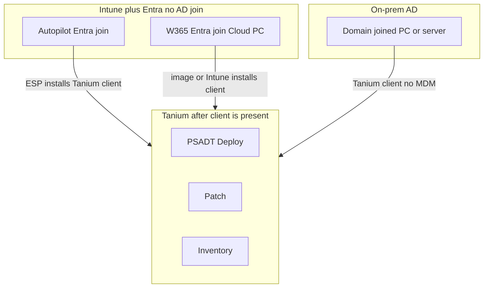

# Can Tanium replace Intune? Autopilot / Windows 365 (no AD join) + on-prem domain join

**The mix you mean:**

1. **Autopilot and Windows 365** — Intune, **Microsoft Entra joined only**. No on-prem Active Directory join. No ODJ connector. Cloud identity.
2. **On-prem PCs and servers** — classic **AD domain joined**. Many are not Intune machines.

**Tanium can manage both.** It does not need a domain join. An Entra-only Cloud PC and a domain-joined lab PC are the same to Deploy once the Tanium client is installed and can reach a Tanium Server or Zone Server.

**Tanium cannot replace Intune.** Autopilot OOBE/ESP and Windows 365 *provisioning* stay Microsoft. Tanium does not Entra-join a device and does not issue a Cloud PC.

If the goal is to drop Autopilot *and* Intune, you need another way to birth PCs: [autopilot-alternatives.md](autopilot-alternatives.md).

## Can Tanium totally replace Intune?

**No.** Entra-only Autopilot/W365 still *needs* Intune. You are not dropping MDM; you are refusing to use Intune as the **PSADT engine**.

| Job | Intune | Tanium |
|---|---|---|
| Entra join at Autopilot / W365 provision | **Yes** | No |
| Autopilot, ESP, hardware hash | **Yes** | No |
| Create Windows 365 Cloud PC | **Yes** | No |
| Conditional Access device compliance | **Yes** (usual path) | Not a replacement |
| MDM profiles, wipe/retire, Company Portal | **Yes** | Not MDM |
| On-prem AD machine, **no** MDM | Weak / none | **Yes** |
| Servers | No | **Yes** |
| PSADT catalog, patch, MW, live logs | Poor fit | **Yes** |

If you turn Intune off, Entra-only Autopilot and W365 provisioning die. Tanium will not replace them.

**One Intune app only:** required install of the **Tanium client** during Autopilot ESP or W365 first boot. That is bootstrap, not the 5,000-title catalog.

## Autopilot without a domain join (Entra only)

This is the default cloud-native Autopilot path: device becomes **Microsoft Entra joined**, Intune enrolled. No computer object in on-prem AD. No Intune Connector for AD.

Tanium is not in OOBE. After ESP:

1. Intune installs Tanium client (or it is in the image).
2. Client talks to **Tanium Zone Server** (these PCs are often internet-first).
3. Deploy/Patch/Interact treat it like any Windows endpoint. **No AD join required.**

User identity is Entra. Some PSADT scripts assume `DOMAIN\user`, a DC, or an AD security group for “who is this?” Those titles are the exceptions to retest — not a reason to hybrid-join the fleet.

## Windows 365 without a domain join

Provision the Cloud PC as **Microsoft Entra joined** (Intune provisioning policy). Tanium does not create the Cloud PC.

Then: Tanium client on the image or via Intune, plus **network path** to a Zone Server or Tanium Server (peering / private net / allowed egress). If the Cloud PC cannot reach Tanium, Deploy will not work. That is routing, not “Tanium requires domain join.”

Hybrid-joined W365 (AD + Entra) is optional and **not** what this page assumes. If you use it later, Tanium still does not do the join; it only manages after the client is on.

## On-prem machines joined to the domain

**Tanium: yes, fully.** No Entra join, no MDM.

These stay AD-joined via SCCM TS / imaging / existing process (Job A). Tanium client in the image or bootstrap. This is the population Intune does not cover. Do not force Autopilot onto it to “standardize.”

## Both worlds (corrected)

| Machine | Identity / join | Who births it? | Who deploys PSADT? |
|---|---|---|---|
| Autopilot PC | **Entra only** — no AD | Intune Autopilot | **Tanium** after client |
| Windows 365 Cloud PC | **Entra only** — no AD | Windows 365 + Intune | **Tanium** after client |
| On-prem PC / server | **AD domain join** | Imaging / TS / existing AD | **Tanium** (no Intune) |

Tanium does **not** care which directory joined the machine. Intune still births the two cloud rows. Intune still does not run the on-prem row.

## What not to do

- Do not drop Intune because “Tanium can manage Entra PCs.” You would lose Autopilot and W365 create.
- Do not hybrid-join Autopilot/W365 just to make Tanium happy. Tanium does not need AD.
- Do not put 5,000 PSADT apps on Autopilot ESP. ESP installs **Tanium**, then Deploy.
- Do not expect Tanium to Entra-join or to issue Cloud PCs.

## Lab proof

1. **Autopilot Entra-only** PC (no AD object): ESP installs Tanium; one known PSADT title from Deploy; Zone Server path works.
2. **Windows 365 Entra-only** Cloud PC: client in; same title; confirm route to Tanium.
3. **On-prem AD-only** PC (no Intune): same title via Tanium only.

Failures on (1) or (2) are almost always **no client** or **no route to Tanium**, not “missing domain join.”
