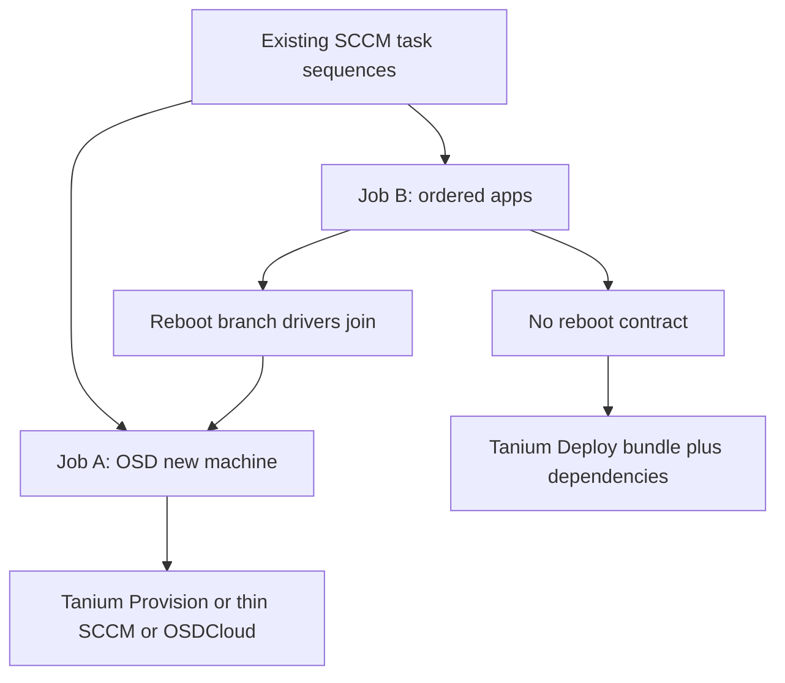

# Task sequences: new machines and ordered applications

A task sequence in this estate is **two jobs** that share one console object. Judging Tanium as if it were “a TS replacement” mixes them and produces a bad decision.

## Job A — Build a new machine (OSD task sequence)

### What we do today

PXE or boot media starts **one** task sequence:

1. Disk / format
2. Apply WIM
3. Drivers
4. Domain join
5. Baseline configuration
6. Long tail of **Install Application**, **Install Package**, **Run Command**, reboots, software updates

At 250k on-prem, this is a primary reason the SCCM site still exists.

### SCCM

This is the product.

- SMSTS **resume after reboot** (continue at step 14)
- Driver packs
- Conditions (laptop vs desktop, locale, chassis)
- Progress UI and per-step retry
- One deployment status for the whole build

### Tanium Provision

Can image a machine and attach a post-provision software list. It is **not** a port of the TS library:

- No SMSTS
- No 1:1 driver catalog
- No operator-familiar “continue at step 14 after reboot”
- Autopilot only covers **Intune-enrolled** PCs — not on-prem build rings or servers

### What this means

Retiring SCCM requires an **explicit imaging owner**. Options:

- Prove Tanium Provision on **one desktop gold image** and **one server build**, or
- Keep a **thin SCCM** (or MDT / OSDCloud) for imaging only until that project is done

**Do not assume Tanium Deploy replaces PXE.** Deploy installs software on a machine that already has an OS and an agent.

## Job B — Deploy many applications in order

### What we do today

A task sequence (on a **new** machine as the OSD tail, or on an **already imaged** machine) installs:

`app1 → wait → (optional reboot) → app2 → app3 → …`

with continue-on-error or hard-fail per step.

This is **not** the same as 5,000 standalone Application deployments to collections.

### SCCM task sequence

- Guaranteed order
- Mid-sequence reboot and resume
- Mixed steps: application, package, command, condition
- One status for the whole chain
- Software Center / TS progress

### Tanium Deploy bundles and dependencies

You can declare “package B requires A” and group titles in a **bundle**. That covers **silent installers that do not need a TS reboot contract** — most MSI / EXE / PSADT “install these eight agents” stacks.

It does **not** give you a linear SMSTS engine:

- Weak mid-chain reboot-and-continue
- Weak in-step branching (`if laptop then X`)
- No single “TS 80% at step 11” view unless you build sensors around each package

### Tanium Interact

You can push package A, wait for a sensor, then push B. That is an **operator procedure**, not a 250k gold-image factory.

### How to split the TS library before judging Tanium

| TS pattern | Destination |
|---|---|
| Baseline app stack, **no** mid-sequence reboot | Tanium Deploy **bundle + explicit dependency order**. Same payloads. |
| Reboot between apps, drivers, domain join, or branching | Stays **Job A** (imaging / orchestrator). Do not force these into Deploy. |

If Job B reboot-resume fails in the lab, those sequences stay on an orchestrator. That does **not** block moving standalone Application deployments to Tanium Deploy.

## Comparison (TS-specific)

| Capability | SCCM TS | Tanium |
|---|---|---|
| Strict step order (app1, reboot, app2) | Native | Partial: dependencies / bundle order; mid-sequence reboot + resume is weak |
| New PC bare-metal / PXE | Best in class | Provision is not equivalent |
| App chain on already-imaged machines | Common | Bundle + dependencies |
| Conditions (laptop, OU, locale) | TS conditions and variables | Targeting via questions; not in-step branching |
| Failure handling (continue on error, retry) | Per step | Per package; no “resume from step 7” |
| Progress / user UI | TS progress / Software Center | Limited unless you add sensors |
| Drivers, domain join, OSD in the same workflow | Yes | Split: Provision + Deploy + something else |

## Pilot that must run (do not skip)

1. **Job B — simple:** one real production TS that installs **8+ applications in order** with **no** mid-chain reboot, rebuilt as a Tanium Deploy bundle with dependencies. Same content, same silent switches.
2. **Job B — hard:** one real TS that **reboots mid-chain**. If Deploy cannot resume cleanly, classify that TS as Job A.
3. **Job A:** one **desktop gold image** and one **server build** using Tanium Provision (or MDT / OSDCloud). If it cannot replace the TS, imaging stays a separate product and the SCCM sunset date must say so.

Full lab list: [pilot-and-sunset.md](pilot-and-sunset.md).

## OSD sunset (do not bury this)

Imaging is a **second project** with a named owner:

| Ring | Off-ramp |
|---|---|
| Enrolled PCs | Autopilot + Intune **enrollment only** — not software delivery |
| On-prem PCs / labs | Tanium Provision **or** MDT / OSDCloud / thin leftover SCCM |
| Servers | Whatever builds them today besides the OSD TS — Tanium Deploy does not inherit this |

If OSD has no owner, **SCCM remains for imaging only** until that project finishes. That is still a sunset, just a longer one. Do not pretend Intune or Tanium Deploy solves PXE.
