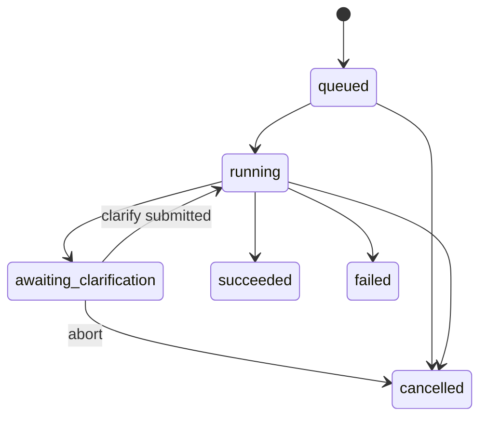

# Packaging AI API — Project Plan (Phase 3)

This document is the **implementation plan** for Packaging AI’s HTTP API. It does **not** implement code; use it as the authoritative guide for a later build pass.

**Parent spec:** [`Project_Packaging.md`](../Project_Packaging.md) (CLI / LangGraph backend v1.0).  
**Status:** Implemented in `packaging_ai/api/` (v1). Ops guide: [`API/README.md`](README.md). Schema: [`API/schema.sql`](schema.sql).

---

## 1. Goal

Expose the existing Packaging AI LangGraph pipeline (`scan → classify → plan → vuln_scan → review → clarify → generate`) as a **REST API** that a website can call for long-running packaging jobs.

### Locked decisions

| Topic | Choice |
|-------|--------|
| App framework | **FastAPI** + **uvicorn** on loopback |
| Edge / TLS | **IIS** terminates HTTPS; **ARR + URL Rewrite** reverse-proxies to uvicorn |
| Process model | uvicorn as a **Windows Service** (or NSSM); IIS does **not** own the Python process |
| Job store | **MS SQL Server** (SQL Authentication) |
| Auth | **`X-API-Key`** header |
| Clarify | Structured REST (`META:` / `UNINSTALL_CMD:` / confirm / abort) — **no** `input()` on API path |
| CLI | Remains fully supported and unchanged for interactive use |

### Why this stack

- Fits Python / LangGraph; natural async job + poll pattern; built-in OpenAPI (`/docs`).
- IIS is the standard Windows HTTPS front door for corporate sites.
- Tradeoff: two processes (IIS + Python) and ARR setup — acceptable for a real website + multi-minute packaging runs.

**Not chosen:** HttpPlatformHandler launching Python from IIS. Separate uvicorn service matches “proxy to localhost,” clearer lifecycle for long jobs, and simpler restarts without recycling the IIS app pool mid-package.

---

## 2. Architecture

```mermaid
flowchart LR
  web[Website] -->|HTTPS X-API-Key| iis[IIS ARR]
  iis -->|HTTP 127.0.0.1:8000| api[FastAPI uvicorn]
  api --> jobs[(SQL Server jobs)]
  api --> worker[Background worker]
  worker --> graph[run_packaging LangGraph]
  graph --> output[output App_Ver Package and logs]
```

| Layer | Role |
|-------|------|
| Website | Creates jobs, polls status, posts clarifications |
| IIS | TLS, optional IP restrictions, reverse proxy |
| FastAPI | Auth, job CRUD, OpenAPI, queues work |
| SQL Server | Durable job rows + optional event audit |
| Worker | Runs LangGraph; updates job status; pauses for clarify |
| Disk | Same `output/{App}_{Ver}/` artifacts as CLI |

**Connection diagram:** [`docs/Packaging_AI_Connections.png`](../docs/Packaging_AI_Connections.png)

### Relationship to CLI

- Shared library: `packaging_ai` (config, models, graph, vuln, psadt).
- CLI entry: `packaging-ai` → `run_packaging()` with interactive clarify.
- API entry: FastAPI → job manager → same graph with **non-interactive** clarify mode.
- Do **not** shell out to the CLI from the API; call Python APIs directly.

---

## 3. Job lifecycle



| Status | Meaning |
|--------|---------|
| `queued` | Accepted; waiting for a worker slot |
| `running` | Graph executing (scan through generate, or resumed after clarify) |
| `awaiting_clarification` | Needs META, uninstall, and/or soft confirm; graph paused |
| `succeeded` | Package + logs written; artifact paths available |
| `failed` | Error recorded; may include partial state |
| `cancelled` | User/API abort |

**Clarification rules (mirror CLI):**

- Soft low confidence: skippable with `auto_confirm=true` on create (same as `-y`).
- EXE metadata (`Publisher|AppName|Version`) and EXE uninstall: **never** skippable via `auto_confirm`.
- Stored clarifications remain `META:…` and `UNINSTALL_CMD:…` for plan rebuild.

**Client pattern:** `POST /v1/jobs` → poll `GET /v1/jobs/{id}` until `awaiting_clarification` or terminal → if needed `POST /v1/jobs/{id}/clarify` → poll until `succeeded` / `failed`.

---

## 4. HTTP API surface

Base URL (external): `https://{iis-host}/` → proxied to `http://127.0.0.1:8000/`.  
API version prefix: `/v1`.

### Auth

- Required header on protected routes: `X-API-Key: <secret>`
- Compare against configured key(s) with constant-time compare.
- `GET /health` may be unauthenticated for load-balancer probes (document in ops).

### Endpoints

| Method | Path | Auth | Purpose |
|--------|------|------|---------|
| `GET` | `/health` | No | Liveness; optional SQL ping field |
| `GET` | `/docs`, `/openapi.json` | Yes (recommended) | OpenAPI UI / schema |
| `POST` | `/v1/jobs` | Yes | Create packaging job |
| `GET` | `/v1/jobs/{id}` | Yes | Job status + summary |
| `GET` | `/v1/jobs` | Yes | List recent jobs (pagination) |
| `POST` | `/v1/jobs/{id}/clarify` | Yes | Submit clarification / abort |
| `GET` | `/v1/jobs/{id}/artifacts` | Yes | Artifact paths / download metadata |
| `GET` | `/v1/jobs/{id}/logs` | Yes | List files in the job `logs/` folder |
| `GET` | `/v1/jobs/{id}/logs/{file_name}` | Yes | Read log/report file content (sandboxed to `logs/`) |
| `POST` | `/v1/jobs/{id}/cancel` | Yes | Request cancel when supported |

### `POST /v1/jobs` — request body

```json
{
  "folder_path": "D:\\absolute\\path\\to\\installer\\folder",
  "output_dir": null,
  "auto_confirm": false
}
```

| Field | Rules |
|-------|--------|
| `folder_path` | **Absolute** path; must exist as a directory on the API host |
| `output_dir` | Optional absolute override; default from config |
| `auto_confirm` | Soft confidence only; cannot skip META / uninstall |

**Response `202 Accepted`:**

```json
{
  "id": "uuid",
  "status": "queued",
  "created_at": "ISO-8601"
}
```

### `GET /v1/jobs/{id}` — response (sketch)

```json
{
  "id": "uuid",
  "status": "awaiting_clarification",
  "folder_path": "D:\\...",
  "confidence_score": 0.72,
  "review_findings": ["..."],
  "clarification_needed": {
    "needs_meta": true,
    "needs_uninstall": true,
    "needs_soft_confirm": false,
    "suggested_uninstall": null,
    "open_questions": []
  },
  "plan_summary": {
    "app_vendor": "",
    "app_name": "",
    "app_version": "",
    "primary_family": "unknown_exe",
    "model": null,
    "reviewer": null
  },
  "error": null,
  "created_at": "...",
  "updated_at": "..."
}
```

### `POST /v1/jobs/{id}/clarify` — request body

```json
{
  "action": "submit",
  "meta": "Publisher|AppName|1.2.3",
  "uninstall_command": "Execute-Process -Path \"$envProgramFiles\\App\\uninstall.exe\" -Parameters \"/S\" -WindowStyle Hidden",
  "uninstall_paste": "\"C:\\Program Files\\App\\uninstall.exe\" /S",
  "confirm": true,
  "abort": false
}
```

| Field | Notes |
|-------|--------|
| `meta` | Becomes `META:Publisher\|AppName\|Version` |
| `uninstall_paste` | Server normalizes Program Files → `$envProgramFiles` / `$envProgramFilesX86` (same as CLI) |
| `uninstall_command` | Already-normalized PSADT command (optional alternative to paste) |
| `confirm` | Soft confirmation |
| `abort` | Cancel job |

Only valid when `status == awaiting_clarification` (except abort/cancel policy as implemented).

### `GET /v1/jobs/{id}/artifacts`

Return paths (and later optional file download routes) for:

- `Install_Plan.json`, `Review_Report.json`, `Vulnerability_Report.json`
- `Packaging_AI.log`, `PSADT_Requirements.md`
- Package dir, deploy script, footprint MST

Same layout as CLI under `output/{AppName}_{Version}/`.

### Errors

Use standard HTTP codes: `400` validation, `401` missing/invalid API key, `404` unknown job, `409` wrong status for clarify, `500` unexpected.

---

## 5. SQL Server

### Connection

- Server example: `WIN-GPHHMLE0KE0` (or host/IP + port `1433`)
- Database: `PackagingAI` (create on SQL VM)
- Auth: **SQL Server Authentication** only for the API service (workgroup; avoid Windows/SSPI for the service account)
- Driver: ODBC Driver 18 for SQL Server + `pyodbc` (sync worker) or `aioodbc` if async pool is preferred later
- Store connection string in env (e.g. `PACKAGING_AI_SQL_CONNECTION`) — **never commit secrets**

### Schema sketch

**`jobs`**

| Column | Type | Notes |
|--------|------|--------|
| `id` | `uniqueidentifier` PK | Job id |
| `status` | `nvarchar(32)` | See lifecycle |
| `folder_path` | `nvarchar(1024)` | Absolute input |
| `output_dir` | `nvarchar(1024)` null | Optional override |
| `auto_confirm` | `bit` | Soft gate |
| `confidence_score` | `float` null | Latest |
| `state_json` | `nvarchar(max)` | Serialized graph/job state (plan, findings, clarifications, artifacts) |
| `clarification_json` | `nvarchar(max)` null | What the UI must collect |
| `error` | `nvarchar(max)` null | Failure message |
| `created_at` / `updated_at` | `datetime2` | UTC |
| `started_at` / `finished_at` | `datetime2` null | Optional |

**`job_events`** (optional audit)

| Column | Type | Notes |
|--------|------|--------|
| `id` | `bigint` identity PK | |
| `job_id` | `uniqueidentifier` FK | |
| `event_type` | `nvarchar(64)` | `created`, `status_changed`, `clarify_received`, … |
| `message` | `nvarchar(max)` null | |
| `created_at` | `datetime2` | UTC |

Indexes: `jobs(status, created_at)`, `job_events(job_id, created_at)`.

### Retention

Document a later policy (e.g. delete or archive jobs older than N days). v1 may keep indefinitely.

---

## 6. IIS and Windows operations

### Target topology

| Machine | Role |
|---------|------|
| API host | IIS + uvicorn Windows Service + Packaging AI install + access to installer folders / `output/` |
| SQL VM | MS SQL Server (`PackagingAI` DB); firewall allow **1433** from API host only |

### IIS site

1. Install **IIS**, **URL Rewrite**, **Application Request Routing (ARR)**.
2. Enable ARR proxy: Application Request Routing Cache → Server Proxy Settings → **Enable proxy**.
3. Site bindings: HTTPS 443 with certificate; optional HTTP→HTTPS redirect.
4. URL Rewrite reverse proxy rule: `https://{iis-host}/{path}` → `http://127.0.0.1:8000/{path}`.
5. Forward `X-API-Key` and useful headers (`X-Forwarded-For`, `X-Forwarded-Proto`).
6. Do **not** expose port 8000 on the public firewall; bind uvicorn to `127.0.0.1` only.

### uvicorn service

- Example: `uvicorn packaging_ai.api.app:app --host 127.0.0.1 --port 8000`
- Install as Windows Service (NSSM or equivalent) with:
  - Working directory = project root
  - Environment: `PACKAGING_AI_CONFIG`, `PACKAGING_AI_SQL_CONNECTION`, `PACKAGING_AI_API_KEYS`, review keys (`OPENAI_API_KEY` / `CURSOR_API_KEY`) as needed
- Recovery: restart on failure
- Logs: reuse `packaging_ai` logging + optional uvicorn access log file

### Why not HttpPlatformHandler here

HttpPlatformHandler is fine for short request/response apps where IIS starts the process. This plan uses **ARR → already-running uvicorn** so packaging jobs are not tied to app-pool recycle and match the “localhost proxy” pattern.

### OpenAPI

After proxy works: `https://{iis-host}/docs` (protect with API key middleware or IIS IP allowlist in production).

---

## 7. Configuration

Extend config / env (no secrets in git):

| Key / env | Purpose |
|-----------|---------|
| `PACKAGING_AI_SQL_CONNECTION` | ODBC / ADO connection string (SQL auth) |
| `PACKAGING_AI_API_KEYS` | Comma-separated valid API keys (or single key) |
| `PACKAGING_AI_API_HOST` | Default `127.0.0.1` |
| `PACKAGING_AI_API_PORT` | Default `8000` |
| Existing packaging config | `templates_dir`, `dark_exe`, `output_dir`, vuln, models, logging |

Optional `packaging_ai.config.json` keys for non-secret defaults (`api_host`, `api_port`); **keys and SQL password stay in env**.

---

## 8. Backend design (build later — do not implement in plan-only phase)

### Proposed layout

```
packaging_ai/
  api/
    __init__.py
    app.py              # FastAPI app, middleware, routers
    auth.py             # X-API-Key dependency
    schemas.py          # Pydantic request/response models
    jobs.py             # routes for /v1/jobs*
    worker.py           # background executor
    repository.py       # SQL Server access
  graph/
    nodes/clarify.py    # keep CLI input(); add API-safe pause path
```

Alternatively host the FastAPI package under `API/` and import `packaging_ai` — prefer **`packaging_ai/api/`** so one installable package serves CLI + API.

### Graph / clarify changes

1. Detect API mode (e.g. `interactive=False` or `clarification_mode="api"` on state).
2. When clarify is required in API mode: persist state to SQL, set `awaiting_clarification`, **return without blocking**.
3. On `POST .../clarify`: merge clarifications into state, set `queued`/`running`, resume graph from plan (same as CLI clarify → plan loop).
4. CLI path continues to use `input()` in `clarify_node`.

Options to evaluate at build time (pick one and stick to it):

- **Checkpoint / resume:** LangGraph interrupt or explicit “pause” return from clarify node + re-invoke with saved state.
- **Two-phase worker:** run until clarify gate in-process; serialize state; resume later.

Prefer the smallest change that preserves CLI behavior.

### Concurrency

- v1: single worker or small thread/process pool (e.g. 1–2 concurrent packages) to avoid disk/dark.exe contention.
- Job claim: update `queued` → `running` with optimistic concurrency or `UPDLOCK` so two workers do not take the same job.

### Dependencies to add (when building)

```text
fastapi
uvicorn[standard]
pyodbc
```

Optional: `python-multipart` if file upload is added later.

### Uploads (follow-on)

v1 assumes installer media already on a path the API host can read (UNC or local). File upload → temp folder can be Phase 3.1.

### Artifact download (follow-on)

v1 returns paths. Later: `GET /v1/jobs/{id}/files/{name}` or zip of `Package/`.

---

## 9. Build phases (when implementing)

### Phase A — Skeleton

- `packaging_ai/api` FastAPI app with `/health` and API-key middleware
- Config/env for keys + SQL connection string parsing
- Run uvicorn locally on `127.0.0.1:8000`

### Phase B — SQL jobs

- Create `PackagingAI` database and `jobs` / `job_events` tables
- Repository + `POST/GET /v1/jobs` with `queued` rows (no graph yet)

### Phase C — Worker + graph (happy path)

- Background worker invokes packaging for jobs that need no clarify
- Persist confidence, findings, artifacts into `state_json`
- `succeeded` / `failed` status

### Phase D — Clarification API

- Non-interactive clarify / pause-resume
- `POST /v1/jobs/{id}/clarify`
- Enforce META / uninstall hard gates (parity with CLI)

### Phase E — IIS

- ARR reverse proxy + HTTPS
- Windows Service for uvicorn
- Firewall and smoke test through public HTTPS URL

### Phase F — Hardening

- Pagination, cancel, retention, structured logging, OpenAPI examples
- Load/smoke tests; document ops runbook

---

## 10. Functional requirements (API)

- [ ] **AFR-1** Accept absolute `folder_path`; reject relative paths
- [ ] **AFR-2** Create job returns quickly (`202`); work is async
- [ ] **AFR-3** Persist job state in SQL Server across API restarts
- [ ] **AFR-4** Poll job status including confidence, findings, clarification needs
- [ ] **AFR-5** Structured clarify for META / uninstall / soft confirm / abort
- [ ] **AFR-6** `auto_confirm` cannot skip META or uninstall
- [ ] **AFR-7** Produce same package/logs layout as CLI
- [ ] **AFR-8** Protect mutating and job routes with `X-API-Key`
- [ ] **AFR-9** SQL Auth to SQL Server (no SSPI dependency for the service)
- [ ] **AFR-10** IIS HTTPS reverse proxy to loopback uvicorn
- [ ] **AFR-11** CLI interactive behavior unchanged
- [ ] **AFR-12** OpenAPI docs available behind the same site

---

## 11. Security notes

- Loopback-only uvicorn; TLS only at IIS.
- Rotate API keys; store in secret store or locked env, not in repo.
- SQL login: least privilege (CRUD on `PackagingAI` tables only).
- Validate `folder_path` / `output_dir` stay within allowed roots if the website is multi-tenant later (v1 may allow any absolute path the service account can read — document the risk).
- Do not return SQL connection strings or API keys in responses.

---

## 12. Out of scope (this Phase 3 API plan)

- Website / SPA UI
- Domain join or Windows Auth to SQL / API
- HttpPlatformHandler process hosting
- LLM-assisted planning (Phase 4)
- VM auto-test of packages (Phase 5)
- CDN / large artifact distribution

---

## 13. Acceptance criteria for a future “API v1 shipped” milestone

1. Website (or curl) can create a job with `X-API-Key` over HTTPS via IIS.
2. Job survives API process restart while `queued` / `awaiting_clarification` (state in SQL).
3. EXE package requiring META + uninstall can complete via clarify endpoints only (no server console).
4. Successful job yields the same `output/{App}_{Ver}/Package` + `logs` artifacts as CLI.
5. CLI `packaging-ai` still works interactively on the same install.
6. Port 8000 is not reachable from other machines; only IIS HTTPS is public.

---

## 14. References

- Backend overview: [`Project_Packaging.md`](../Project_Packaging.md)
- VS Code recreate (CLI): [`Project_Packaging_VSCode.md`](../Project_Packaging_VSCode.md)
- Graph entry: `packaging_ai/graph/__init__.py` → `run_packaging`
- Clarify today: `packaging_ai/graph/nodes/clarify.py` (`input()`)
- Models: `packaging_ai/models.py`
